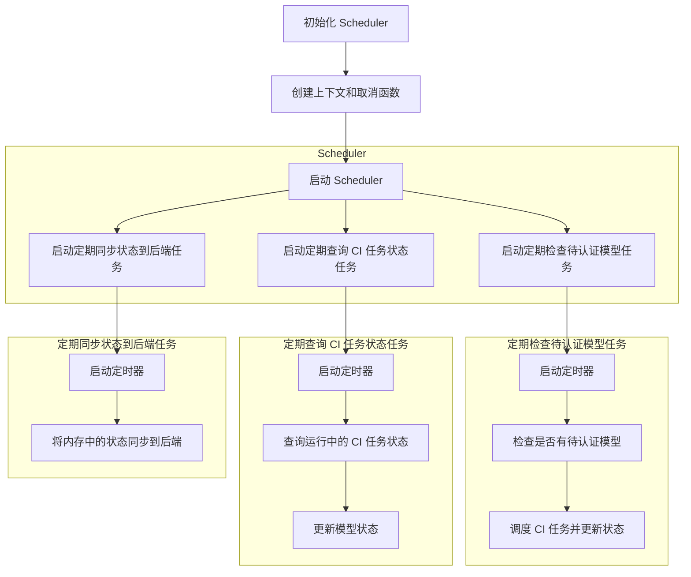
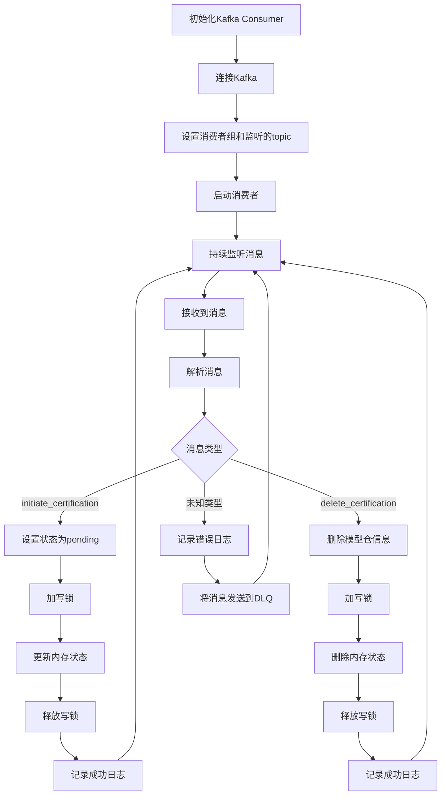

# CI-Adapter服务设计


## 程序结构

```go
ci-adapter-server/
├── cmd/
│   └── main.go
├── internal/
│   ├── models/
│   │   └── model.go
│   ├── scheduler/
│   │   └── scheduler.go
│   ├── kafka/
│   │   └── consumer.go
│   ├── ci/
│   │   └── ci_client.go
│   ├── backend/
│   │   └── backend_client.go
├── config/
│   ├── configmap.yaml
│   └── secret.yaml
├── deploy/
│   └── deployment.yaml
├── go.mod
└── go.sum
```

### 目录和文件说明

- `cmd/main.go`：程序的入口文件，包含 `main` 函数。
- `internal/models/model.go`：定义内存中的模型仓状态信息结构体。
- `internal/scheduler/scheduler.go`：定义Scheduler模块，包括定期任务的实现。
- `internal/kafka/consumer.go`：定义Kafka Consumer模块，包括消息处理逻辑。
- `internal/ci/ci_client.go`：定义与CI服务交互的客户端。
- `internal/backend/backend_client.go`：定义与社区后端交互的客户端，包括恢复内存状态的逻辑。
- `config/configmap.yaml`：Kubernetes ConfigMap文件，存储非敏感的配置信息。
- `config/secret.yaml`：Kubernetes Secret文件，存储敏感的配置信息，如API tokens。
- `deploy/deployment.yaml`：Kubernetes Deployment文件，定义服务的部署配置。
- `go.mod` 和 `go.sum`：Go模块管理文件，管理项目依赖。


## 部署配置

服务部署在Kubernetes中，因为涉及到与Kafka、外部服务的交互，因此需要存放配置信息在ConfigMap中，存在token敏感信息在Secret中。

### ConfigMap

```yaml
apiVersion: v1
kind: ConfigMap
metadata:
  name: ci-adapter-config
data:
  KAFKA_BROKERS: "kafka-broker1:9092,kafka-broker2:9092"
  KAFKA_GROUP_ID: "ci-adapter-group"
  KAFKA_TOPIC: "model-events"
  CI_BASE_URL: "https://ci.codearts.com"
  BACKEND_BASE_URL: "https://backend.service.com"
  CHECK_PENDING_INTERVAL: "10m"
  QUERY_CI_STATUS_INTERVAL: "5m"
  SYNC_BACKEND_INTERVAL: "20m"

```


### Secret

```yaml
apiVersion: v1
kind: Secret
metadata:
  name: ci-adapter-secrets
type: Opaque
data:
  CI_API_TOKEN: <base64-encoded-ci-api-token>
```

​	其中的敏感信息需要通过base64加密：

```shell
echo -n 'your-ci-api-token' | base64
```


### Deployment

```yaml
apiVersion: apps/v1
kind: Deployment
metadata:
  name: ci-adapter
spec:
  replicas: 1
  selector:
    matchLabels:
      app: ci-adapter
  template:
    metadata:
      labels:
        app: ci-adapter
    spec:
      containers:
      - name: ci-adapter
        image: ci-adapter:latest
        env:
        - name: KAFKA_BROKERS
          valueFrom:
            configMapKeyRef:
              name: ci-adapter-config
              key: KAFKA_BROKERS
        - name: KAFKA_GROUP_ID
          valueFrom:
            configMapKeyRef:
              name: ci-adapter-config
              key: KAFKA_GROUP_ID
        - name: KAFKA_TOPIC
          valueFrom:
            configMapKeyRef:
              name: ci-adapter-config
              key: KAFKA_TOPIC
        - name: CI_BASE_URL
          valueFrom:
            configMapKeyRef:
              name: ci-adapter-config
              key: CI_BASE_URL
        - name: BACKEND_BASE_URL
          valueFrom:
            configMapKeyRef:
              name: ci-adapter-config
              key: BACKEND_BASE_URL
        - name: CHECK_PENDING_INTERVAL
          valueFrom:
            configMapKeyRef:
              name: ci-adapter-config
              key: CHECK_PENDING_INTERVAL
        - name: QUERY_CI_STATUS_INTERVAL
          valueFrom:
            configMapKeyRef:
              name: ci-adapter-config
              key: QUERY_CI_STATUS_INTERVAL
        - name: SYNC_BACKEND_INTERVAL
          valueFrom:
            configMapKeyRef:
              name: ci-adapter-config
              key: SYNC_BACKEND_INTERVAL
        - name: CI_API_TOKEN
          valueFrom:
            secretKeyRef:
              name: ci-adapter-secrets
              key: CI_API_TOKEN
```


### Dockefile

```dockerfile
FROM golang:1.18-alpine AS builder

WORKDIR /app

COPY go.mod go.sum ./

RUN go mod download

# 将源代码复制到工作目录
COPY . .

RUN CGO_ENABLED=0 GOOS=linux go build -o /ci-adapter-server cmd/main.go

FROM alpine:latest

WORKDIR /root/

COPY --from=builder /ci-adapter-server .

EXPOSE 8080

CMD ["./ci-adapter-server"]

```


## 数据结构

### Kafka消息事件结构体

```go
package models

type KafkaEvent struct {
    EventType string `json:"event_type"`
    GroupName string `json:"group_name"`
    ModelName string `json:"model_name"`
    ModelID   string `json:"model_id"`
    ModelURL  string `json:"model_url"`
    ID        string `json:"id"`
}
```


### 内存中`ModelInfo`相关

```go
package models

type CITaskInfo struct {
    TaskID    string `json:"task_id" yaml:"task_id"`
    ModelID   string `json:"model_id" yaml:"model_id"`
    Status    string `json:"status" yaml:"status"`
    ReportURL string `json:"report_url" yaml:"report_url"`
}

type ModelInfo struct {
    GroupName   string     `json:"group_name" yaml:"group_name"`
    ModelName   string     `json:"model_name" yaml:"model_name"`
    ModelID     string     `json:"model_id" yaml:"model_id"`  // 格式: GroupName/ModelName
    Version     string     `json:"version" yaml:"version"`
    TestStatus  string     `json:"test_status" yaml:"test_status"`  // 修改字段名
    LastUpdated string     `json:"last_updated" yaml:"last_updated"`
    CITask      CITaskInfo `json:"ci_task" yaml:"ci_task"`  // 添加CITaskInfo属性
}

type ModelState struct {
    Models map[string]ModelInfo `json:"models" yaml:"models"`
}

```


### 与社区后端交互

```go
package models

type ModelStatus struct {
    ModelID string `json:"model_id"`
    Status  string `json:"status"`
}

type UpdateModelStatusRequest struct {
    Statuses []ModelStatus `json:"statuses"`
}
```


## API交互层

### CodeArts

**职责**：

- 下发CI任务。
- 查询CI任务状态。


#### CodeArts CI API 模块

##### 下发CI任务

**接口**：

```go
func DispatchCITask(modelInfo models.ModelInfo) (models.CITaskInfo, error)
```

**伪代码**：

```pseudocode
function DispatchCITask(modelInfo):
    create request payload from modelInfo
    send request to CodeArts CI service
    if request is successful:
        return taskInfo
    else:
        return error
```


##### 查询CI任务状态

**接口**：

```go
func GetCITaskStatus(taskID string) (models.CITaskInfo, error)
```

**伪代码**：

```pseudocode
function GetCITaskStatus(taskID):
    create request to query task status by taskID
    send request to CodeArts CI service
    if request is successful:
        return taskStatus
    else:
        return error
```


##### 实现

```go
package ci

import (
    "bytes"
    "encoding/json"
    "fmt"
    "net/http"
    "ci-adapter-server/internal/models"
)

type CodeArtsClient struct {
    BaseURL    string
    APIToken   string
}

func NewCodeArtsClient(baseURL, apiToken string) *CodeArtsClient {
    return &CodeArtsClient{
        BaseURL:  baseURL,
        APIToken: apiToken,
    }
}

func (c *CodeArtsClient) DispatchCITask(modelInfo models.ModelInfo) (models.CITaskInfo, error) {
    url := fmt.Sprintf("%s/dispatch", c.BaseURL)
    payload, err := json.Marshal(modelInfo)
    if err != nil {
        return models.CITaskInfo{}, err
    }

    req, err := http.NewRequest("POST", url, bytes.NewBuffer(payload))
    if err != nil {
        return models.CITaskInfo{}, err
    }
    req.Header.Set("Authorization", "Bearer "+c.APIToken)
    req.Header.Set("Content-Type", "application/json")

    client := &http.Client{}
    resp, err := client.Do(req)
    if err != nil {
        return models.CITaskInfo{}, err
    }
    defer resp.Body.Close()

    if resp.StatusCode != http.StatusOK {
        return models.CITaskInfo{}, fmt.Errorf("failed to dispatch CI task, status code: %d", resp.StatusCode)
    }

    var taskInfo models.CITaskInfo
    if err := json.NewDecoder(resp.Body).Decode(&taskInfo); err != nil {
        return models.CITaskInfo{}, err
    }

    return taskInfo, nil
}

func (c *CodeArtsClient) GetCITaskStatus(taskID string) (models.CITaskInfo, error) {
    url := fmt.Sprintf("%s/task/%s/status", c.BaseURL, taskID)

    req, err := http.NewRequest("GET", url, nil)
    if err != nil {
        return models.CITaskInfo{}, err
    }
    req.Header.Set("Authorization", "Bearer "+c.APIToken)

    client := &http.Client{}
    resp, err := client.Do(req)
    if err != nil {
        return models.CITaskInfo{}, err
    }
    defer resp.Body.Close()

    if resp.StatusCode != http.StatusOK {
        return models.CITaskInfo{}, fmt.Errorf("failed to get CI task status, status code: %d", resp.StatusCode)
    }

    var taskStatus models.CITaskInfo
    if err := json.NewDecoder(resp.Body).Decode(&taskStatus); err != nil {
        return models.CITaskInfo{}, err
    }

    return taskStatus, nil
}
```


### 社区后端

**职责**：

- 更新模型状态。


#### 后端服务 API 模块

##### 更新模型状态

**接口**：

```go
func UpdateModelStatus(updateRequest models.UpdateModelStatusRequest) error
```

**伪代码**：

```pseudocode
function UpdateModelStatus(updateRequest):
    create request payload from updateRequest
    send request to backend service
    if request is successful:
        return nil
    else:
        return error
```


##### 恢复模型状态

接口：

```go
func GetModelState()(*models.ModelState, error)
```


##### 实现

```go
package backend

import (
    "bytes"
    "encoding/json"
    "fmt"
    "net/http"
    "ci-adapter-server/internal/models"
)

type BackendClient struct {
    BaseURL string
}

func NewBackendClient(baseURL string) *BackendClient {
    return &BackendClient{
        BaseURL: baseURL,
    }
}

func (b *BackendClient) UpdateModelStatus(updateRequest models.UpdateModelStatusRequest) error {
    url := fmt.Sprintf("%s/updateStatus", b.BaseURL)
    payload, err := json.Marshal(updateRequest)
    if err != nil {
        return err
    }

    req, err := http.NewRequest("POST", url, bytes.NewBuffer(payload))
    if err != nil {
        return err
    }
    req.Header.Set("Content-Type", "application/json")

    client := &http.Client{}
    resp, err := client.Do(req)
    if err != nil {
        return err
    }
    defer resp.Body.Close()

    if resp.StatusCode != http.StatusOK {
        return fmt.Errorf("failed to update model status, status code: %d", resp.StatusCode)
    }

    return nil
}

func (b *BackendClient) GetModelState() (*models.ModelState, error) {
    url := fmt.Sprintf("%s/api/modelstate", b.BaseURL)
    resp, err := http.Get(url)
    if err != nil {
        return nil, err
    }
    defer resp.Body.Close()

    if resp.StatusCode != http.StatusOK {
        return nil, fmt.Errorf("failed to get model state, status code: %d", resp.StatusCode)
    }

    var state models.ModelState
    if err := json.NewDecoder(resp.Body).Decode(&state); err != nil {
        return nil, err
    }

    return &state, nil
}
```


### ~~Gitee~~

**职责**：

- 保存状态到Gitee。
- 从Gitee恢复状态。


#### ~~Gitee API 模块~~

##### ~~保存状态到Gitee~~


**接口**：

```go
func SaveStateToGitee(state models.ModelState) error
```

**伪代码**：

```pseudocode
function SaveStateToGitee(state):
    convert state to YAML format
    create request payload
    send request to Gitee to update YAML file
    if request is successful:
        return nil
    else:
        return error
```


##### ~~从Gitee恢复状态~~

**接口**：

```go
func LoadStateFromGitee() (models.ModelState, error)
```

**伪代码**：

```pseudocode
function LoadStateFromGitee():
    create request to fetch YAML file from Gitee
    send request to Gitee
    if request is successful:
        parse YAML content to state
        return state
    else:
        return error
```


##### ~~实现~~

```go
package gitee

import (
    "bytes"
    "encoding/json"
    "fmt"
    "net/http"
    "os"
    "ci-adapter-server/internal/models"
    "gopkg.in/yaml.v2"
)

type GiteeClient struct {
    Repo       string
    FilePath   string
    Token      string
}

func NewGiteeClient(repo, filePath, token string) *GiteeClient {
    return &GiteeClient{
        Repo:     repo,
        FilePath: filePath,
        Token:    token,
    }
}

func (g *GiteeClient) SaveStateToGitee(state models.ModelState) error {
    url := fmt.Sprintf("https://gitee.com/api/v5/repos/%s/contents/%s", g.Repo, g.FilePath)
    yamlData, err := yaml.Marshal(state)
    if err != nil {
        return err
    }

    payload := map[string]string{
        "content": base64.StdEncoding.EncodeToString(yamlData),
        "message": "Update model state",
    }
    payloadData, err := json.Marshal(payload)
    if err != nil {
        return err
    }

    req, err := http.NewRequest("PUT", url, bytes.NewBuffer(payloadData))
    if err != nil {
        return err
    }
    req.Header.Set("Authorization", fmt.Sprintf("token %s", g.Token))
    req.Header.Set("Content-Type", "application/json")

    client := &http.Client{}
    resp, err := client.Do(req)
    if err != nil {
        return err
    }
    defer resp.Body.Close()

    if resp.StatusCode != http.StatusOK {
        return fmt.Errorf("failed to update YAML file, status code: %d", resp.StatusCode)
    }

    return nil
}

func (g *GiteeClient) LoadStateFromGitee() (models.ModelState, error) {
    url := fmt.Sprintf("https://gitee.com/api/v5/repos/%s/contents/%s", g.Repo, g.FilePath)

    req, err := http.NewRequest("GET", url, nil)
    if err != nil {
        return models.ModelState{}, err
    }
    req.Header.Set("Authorization", fmt.Sprintf("token %s", g.Token))

    client := &http.Client{}
    resp, err := client.Do(req)
    if err != nil {
        return models.ModelState{}, err
    }
    defer resp.Body.Close()

    if resp.StatusCode != http.StatusOK {
        return models.ModelState{}, fmt.Errorf("failed to fetch YAML file, status code: %d", resp.StatusCode)
    }

    var content struct {
        Content string `json:"content"`
    }
    if err := json.NewDecoder(resp.Body).Decode(&content); err != nil {
        return models.ModelState{}, err
    }

    decodedData, err := base64.StdEncoding.DecodeString(content.Content)
    if err != nil {
        return models.ModelState{}, err
    }

    var state models.ModelState
    if err := yaml.Unmarshal(decodedData, &state); err != nil {
        return models.ModelState{}, err
    }

    return state, nil
}
```


## Scheduler模块

### 功能和职责

1. **检查待认证模型仓**：
   - 周期性任务，检查内存中状态为 `pending` 的模型仓。
   - 调用 CI API 模块下发 CI 任务。
   - 更新内存状态为 `running`。
2. **查询 CI 任务状态**：
   - 周期性任务，查询所有状态为 `running` 的任务的状态。
   - 调用 CI API 模块查询任务状态。
   - 根据查询结果更新内存状态为 `success` 或 `failed`。
3. **同步状态到社区后端服务**：
   - 周期性任务，将内存状态通过 API 同步到社区后端服务。


### 流程




### API设计

#### 初始化 Scheduler

**接口**：

```go
func InitScheduler(checkPendingInterval, queryCIStatusInterval, syncBackendInterval time.Duration) *Scheduler
```

**参数**：

- `checkPendingInterval`：检查待认证模型仓的时间间隔。
- `queryCIStatusInterval`：查询 CI 任务状态的时间间隔。
- `syncBackendInterval`：同步状态到社区后端服务的时间间隔。


#### 启动 Scheduler

**接口**：

```go
func (s *Scheduler) Start() error
```

**描述**： 启动 Scheduler，并开始执行各周期性任务。


#### 停止 Scheduler

**接口**：

```go
func (s *Scheduler) Stop() error
```

**描述**： 停止 Scheduler，并终止各周期性任务。


### 实现

#### Scheduler结构体和初始化

```go
package scheduler

import (
    "context"
    "sync"
    "time"
    "ci-adapter-server/internal/models"
    "ci-adapter-server/internal/ci"
    "ci-adapter-server.internal/backend"
    "ci-adapter-server/internal/gitee"
)

type Scheduler struct {
    checkPendingInterval    time.Duration
    queryCIStatusInterval   time.Duration
    syncBackendInterval     time.Duration
    ciClient                *ci.CodeArtsClient
    backendClient           *backend.BackendClient
    giteeClient             *gitee.GiteeClient
    state                   *models.ModelState
    ctx                     context.Context
    cancel                  context.CancelFunc
    mu                      *sync.RWMutex  // 接受外部传入的读写锁
}

func InitScheduler(checkPendingInterval, queryCIStatusInterval, syncBackendInterval time.Duration, ciClient *ci.CodeArtsClient, backendClient *backend.BackendClient, giteeClient *gitee.GiteeClient, state *models.ModelState, mu *sync.RWMutex) *Scheduler {
    ctx, cancel := context.WithCancel(context.Background())
    return &Scheduler{
        checkPendingInterval:    checkPendingInterval,
        queryCIStatusInterval:   queryCIStatusInterval,
        syncBackendInterval:     syncBackendInterval,
        ciClient:                ciClient,
        backendClient:           backendClient,
        giteeClient:             giteeClient,
        state:                   state,
        ctx:                     ctx,
        cancel:                  cancel,
        mu:                      mu,  // 使用外部传入的读写锁
    }
}

```


#### 启动Scheduler

```go
package scheduler

import (
    "log"
    "time"
)

func (s *Scheduler) Start() error {
    log.Println("Starting scheduler...")
    go s.startCheckPendingModels()
    go s.startQueryCITaskStatus()
    go s.startSyncStateToBackend()
    return nil
}

func (s *Scheduler) startCheckPendingModels() {
    ticker := time.NewTicker(s.checkPendingInterval)
    defer ticker.Stop()
    for {
        select {
        case <-s.ctx.Done():
            log.Println("Stopping check pending models task...")
            return
        case <-ticker.C:
            if err := s.CheckPendingModels(); err != nil {
                log.Printf("Error checking pending models: %v", err)
            }
        }
    }
}

func (s *Scheduler) startQueryCITaskStatus() {
    ticker := time.NewTicker(s.queryCIStatusInterval)
    defer ticker.Stop()
    for {
        select {
        case <-s.ctx.Done():
            log.Println("Stopping query CI task status task...")
            return
        case <-ticker.C:
            if err := s.QueryCITaskStatus(); err != nil {
                log.Printf("Error querying CI task status: %v", err)
            }
        }
    }
}


func (s *Scheduler) startSyncStateToBackend() {
    ticker := time.NewTicker(s.syncBackendInterval)
    defer ticker.Stop()
    for {
        select {
        case <-s.ctx.Done():
            log.Println("Stopping sync state to backend task...")
            return
        case <-ticker.C:
            if err := s.SyncStateToBackend(); err != nil {
                log.Printf("Error syncing state to backend: %v", err)
            }
        }
    }
}
```


#### 停止Scheduler

```go
package scheduler

import (
    "log"
)

func (s *Scheduler) Stop() error {
    log.Println("Stopping scheduler...")
    s.cancel()
    return nil
}
```


#### 下发CI用例执行任务

   针对内存状态修改的地方使用写锁

```go
func (s *Scheduler) CheckPendingModels() error {
    log.Println("Checking pending models...")
    
    for _, model := range s.state.Models {
        if model.TestStatus == "pending" {
            taskInfo, err := s.ciClient.DispatchCITask(model)
            if err != nil {
                log.Printf("Failed to dispatch CI task for model %s: %v", model.ModelID, err)
                continue
            }
            
            s.mu.Lock()  // 获取写锁
            model.CITask = taskInfo
            model.TestStatus = "running"
            s.state.Models[model.ModelID] = model
            s.mu.Unlock()  // 释放写锁
            
            log.Printf("Dispatched CI task for model %s, updated status to running", model.ModelID)
        }
    }
    
    return nil
}
```


#### 查询CI任务状态

针对内存状态修改的地方使用写锁

```go
func (s *Scheduler) QueryCITaskStatus() error {
    log.Println("Querying CI task status...")
    
    for _, model := range s.state.Models {
        if model.TestStatus == "running" {
            taskStatus, err := s.ciClient.GetCITaskStatus(model.CITask.TaskID)
            if err != nil {
                log.Printf("Failed to get CI task status for model %s: %v", model.ModelID, err)
                continue
            }
            
            s.mu.Lock()  // 获取写锁
            model.CITask = taskStatus
            if taskStatus.Status == "success" || taskStatus.Status == "failed" {
                model.TestStatus = taskStatus.Status
            }
            s.state.Models[model.ModelID] = model
            s.mu.Unlock()  // 释放写锁
            
            log.Printf("Updated CI task status for model %s to %s", model.ModelID, taskStatus.Status)
        }
    }
    
    return nil
}

```


#### 同步状态到后端

````go

func (s *Scheduler) SyncStateToBackend() error {
    log.Println("Syncing state to backend...")
    
    s.mu.RLock()  // 获取读锁
    var statuses []models.ModelStatus
    for _, model := range s.state.Models {
        statuses = append(statuses, models.ModelStatus{
            ModelID: model.ModelID,
            Status:  model.TestStatus,
        })
    }
    s.mu.RUnlock()  // 释放读锁
    
    updateRequest := models.UpdateModelStatusRequest{
        Statuses: statuses,
    }
    if err := s.backendClient.UpdateModelStatus(updateRequest); err != nil {
        log.Printf("Failed to sync state to backend: %v", err)
        return err
    }
    
    log.Println("Successfully synced state to backend")
    return nil
}

````


## Kafka Consumer模块

### 约束与限制

1. **消息顺序**：
   - 确保按顺序处理Kafka消息，并更新内存状态。
   - 使用Kafka消费者组的自动负载均衡和分区分配策略，保证消息顺序。
2. **错误处理**：
   - 如果处理消息失败，将消息发送到死信队列（DLQ）。
   - 在处理消息时出现错误后，确保不会影响后续消息的处理。
3. **并发控制**：
   - 使用共享的读写锁（`sync.RWMutex`）来保护对内存状态的并发访问，确保数据一致性。
4. **高可用性**：
   - 保证消费者能够自动重连Kafka集群，处理临时网络故障。
   - 支持Kafka消费者组的重平衡机制，保证消费者高可用。


### 流程

1. **初始化Kafka Consumer**：
   - 连接Kafka，设置消费者组和监听的topic。
2. **启动消费者**：
   - 持续监听Kafka中的模型仓用例事件消息。
3. **处理消息**：
   - 解析消息内容，基于 `event_type` 执行相应的操作（设置 `pending` 状态或删除模型仓信息）。
   - 在处理消息时加写锁，确保对内存状态的修改是线程安全的。
   - 如果处理失败，将消息发送到死信队列（DLQ）。




### API设计


#### 初始化Kafka Consumer

**接口**：

```go
func NewConsumer(brokers []string, groupID string, topic string, state *models.ModelState, mu *sync.RWMutex) (*Consumer, error)
```

**参数**：

- `brokers`：Kafka brokers 地址列表。
- `groupID`：消费者组 ID。
- `topic`：监听的 Kafka 主题。
- `state`：共享的内存状态。
- `mu`：共享的读写锁。


#### 启动Kafka Consumer

**接口**：

```go
func (c *Consumer) StartConsumer() error
```

**描述**： 启动Kafka消费者并开始监听消息。


#### 处理消息

**接口**：

```go
func (c *Consumer) HandleMessage(msg *sarama.ConsumerMessage) error
```

**描述**： 处理接收到的Kafka消息，基于 `event_type` 执行相应的操作。


#### 发送消息到死信队列（DLQ）

**接口**：

```go
func sendToDLQ(msg *sarama.ConsumerMessage)
```

**描述**： 将处理失败的消息发送到死信队列。


### 实现

#### Consumer结构体和初始化

```go
package kafka

import (
    "sync"
    "ci-adapter-server/internal/models"
    "github.com/Shopify/sarama"
)

type Consumer struct {
    client  sarama.ConsumerGroup
    topic   string
    state   *models.ModelState
    mu      *sync.RWMutex
    handler ConsumerGroupHandler
}

type ConsumerGroupHandler struct {
    ready chan bool
}

func NewConsumer(brokers []string, groupID string, topic string, state *models.ModelState, mu *sync.RWMutex) (*Consumer, error) {
    config := sarama.NewConfig()
    config.Version = sarama.V2_1_0_0
    config.Consumer.Group.Rebalance.Strategy = sarama.BalanceStrategyRoundRobin
    config.Consumer.Offsets.Initial = sarama.OffsetOldest

    client, err := sarama.NewConsumerGroup(brokers, groupID, config)
    if err != nil {
        return nil, err
    }

    consumer := &Consumer{
        client:  client,
        topic:   topic,
        state:   state,
        mu:      mu,
        handler: ConsumerGroupHandler{ready: make(chan bool)},
    }

    return consumer, nil
}
```


#### 启动Consumer

```go
package kafka

import (
    "context"
    "log"
)

func (c *Consumer) StartConsumer() error {
    ctx := context.Background()
    go func() {
        for {
            if err := c.client.Consume(ctx, []string{c.topic}, &c.handler); err != nil {
                log.Printf("Error from consumer: %v", err)
            }
            if ctx.Err() != nil {
                log.Printf("Context error: %v", ctx.Err())
                return
            }
            c.handler.ready = make(chan bool)
        }
    }()
    <-c.handler.ready
    log.Println("Sarama consumer up and running!")
    return nil
}

func (h *ConsumerGroupHandler) Setup(sess sarama.ConsumerGroupSession) error {
    close(h.ready)
    return nil
}

func (h *ConsumerGroupHandler) Cleanup(sess sarama.ConsumerGroupSession) error {
    return nil
}

func (h *ConsumerGroupHandler) ConsumeClaim(sess sarama.ConsumerGroupSession, claim sarama.ConsumerGroupClaim) error {
    for msg := range claim.Messages() {
        log.Printf("Message claimed: value = %s, timestamp = %v, topic = %s", string(msg.Value), msg.Timestamp, msg.Topic)
        if err := HandleMessage(sess, msg); err != nil {
            log.Printf("Failed to handle message: %v", err)
            sendToDLQ(msg)
        } else {
            sess.MarkMessage(msg, "")
        }
    }
    return nil
}
```


#### 消息处理

```go
package kafka

import (
    "encoding/json"
    "log"
    "ci-adapter-server/internal/models"
    "github.com/Shopify/sarama"
)

func (c *Consumer) HandleMessage(msg *sarama.ConsumerMessage) error {
    var event models.KafkaEvent
    if err := json.Unmarshal(msg.Value, &event); err != nil {
        return err
    }

    c.mu.Lock()  // 获取写锁
    defer c.mu.Unlock()  // 释放写锁

    switch event.EventType {
    case "initiate_certification":
        // 发起认证事件
        modelInfo := models.ModelInfo{
            GroupName:  event.GroupName,
            ModelName:  event.ModelName,
            ModelID:    event.ModelID,
            TestStatus: "pending",
            CITask:     models.CITaskInfo{},
            // 其他必要字段
        }
        c.state.Models[modelInfo.ModelID] = modelInfo
        log.Printf("Set model %s to pending", modelInfo.ModelID)
    case "delete_certification":
        // 删除认证事件
        delete(c.state.Models, event.ModelID)
        log.Printf("Deleted model %s from state", event.ModelID)
    default:
        log.Printf("Unknown event type %s for model %s", event.EventType, event.ModelID)
        return fmt.Errorf("unknown event type %s", event.EventType)
    }

    return nil
}
```


#### 发送给DLQ队列

```go
package kafka

import (
    "log"
    "github.com/Shopify/sarama"
)

func sendToDLQ(msg *sarama.ConsumerMessage) {
    dlqProducer, err := sarama.NewSyncProducer([]string{"dlq-broker:9092"}, nil)
    if err != nil {
        log.Printf("Failed to create DLQ producer: %v", err)
        return
    }
    defer dlqProducer.Close()

    dlqMsg := &sarama.ProducerMessage{
        Topic: "dead-letter-queue",
        Value: sarama.StringEncoder(msg.Value),
    }

    _, _, err = dlqProducer.SendMessage(dlqMsg)
    if err != nil {
        log.Printf("Failed to send message to DLQ: %v", err)
    }
}
```


## 主流程

主流程需要包括服务启动时，从社区后端服务获取模型最新认证状态的流程。内存构建完成后，才开始启动kafka监听等流程。


```go
package main

import (
    "log"
    "os"
    "sync"
    "time"
    "ci-adapter-server/internal/models"
    "ci-adapter-server/internal/scheduler"
    "ci-adapter-server/internal/kafka"
    "ci-adapter-server/internal/ci"
    "ci-adapter-server/internal/backend"
)

func getEnv(key string, defaultValue string) string {
    value := os.Getenv(key)
    if value == "" {
        return defaultValue
    }
    return value
}

func main() {
    // 初始化读写锁
    mu := &sync.RWMutex{}

    // 配置 Kafka
    kafkaBrokers := getEnv("KAFKA_BROKERS", "kafka-broker1:9092,kafka-broker2:9092")
    kafkaGroupID := getEnv("KAFKA_GROUP_ID", "ci-adapter-group")
    kafkaTopic := getEnv("KAFKA_TOPIC", "model-events")

    // 初始化 CI 客户端
    ciBaseURL := getEnv("CI_BASE_URL", "https://ci.codearts.com")
    ciAPIToken := os.Getenv("CI_API_TOKEN")
    ciClient := ci.NewCodeArtsClient(ciBaseURL, ciAPIToken)

    // 初始化后端服务客户端
    backendBaseURL := getEnv("BACKEND_BASE_URL", "https://backend.service.com")
    backendClient := backend.NewBackendClient(backendBaseURL)

    // 恢复内存状态
    state, err := backendClient.GetModelState()
    if err != nil {
        log.Fatalf("Failed to restore state from backend: %v", err)
    }

    // 初始化 Scheduler
    checkPendingInterval, _ := time.ParseDuration(getEnv("CHECK_PENDING_INTERVAL", "10m"))
    queryCIStatusInterval, _ := time.ParseDuration(getEnv("QUERY_CI_STATUS_INTERVAL", "5m"))
    syncBackendInterval, _ := time.ParseDuration(getEnv("SYNC_BACKEND_INTERVAL", "20m"))
    sched := scheduler.InitScheduler(
        checkPendingInterval,   // 检查待认证模型仓的时间间隔
        queryCIStatusInterval,  // 查询 CI 任务状态的时间间隔
        syncBackendInterval,    // 同步状态到社区后端服务的时间间隔
        ciClient,
        backendClient,
        state,
        mu,
    )

    // 初始化 Kafka Consumer
    consumer, err := kafka.NewConsumer(kafkaBrokers, kafkaGroupID, kafkaTopic, state, mu)
    if err != nil {
        log.Fatalf("Failed to create Kafka consumer: %v", err)
    }

    // 启动 Scheduler 和 Kafka Consumer
    go func() {
        if err := sched.Start(); err != nil {
            log.Fatalf("Scheduler failed to start: %v", err)
        }
    }()
    go func() {
        if err := consumer.StartConsumer(); err != nil {
            log.Fatalf("Kafka consumer failed to start: %v", err)
        }
    }()

    // 等待服务运行
    select {}
}
```


## 其他

编译、构建、镜像推送：

```shell
#!/bin/bash

# 设置变量
IMAGE_NAME="remote-repo/ci-adapter-server"
TAG="latest"
BUILD_DIR="./ci-adapter-server"

# 编译服务
echo "Building the service..."
CGO_ENABLED=0 GOOS=linux go build -o ${BUILD_DIR} cmd/main.go

# 构建 Docker 镜像
echo "Building the Docker image..."
docker build -t ${IMAGE_NAME}:${TAG} .

# 推送 Docker 镜像到镜像仓库
echo "Pushing the Docker image to the repository..."
docker push ${IMAGE_NAME}:${TAG}

echo "Done."
```

