## 魔乐社区支持模型精度测试


>迭代计划：
>
>- 1130: 支持精度推理测试
>
>- 1230: 支持精度训练测试、测试历史查看

## 需求描述

### 需求概述

魔乐社区新增支持模型精度对比测试，涵盖训练和推理场景，支持文生文（text-generation）类型的任务相关模型发起对比测试。精度测试支持基于用户导入的GPU基线数据进行比对测试，支持推理输出比对和训练loss比对，支持NPU上测试作为基线运行生成新基线，且针对不同规模的模型支持**单机多卡**分布式训推支持。精度测试和可用性测试均作为基础的测试策略，支持通过测试的策略组合，进行生态模型、精品模型的多样性测试组合。


### 用户角色和操作

用户：

- 查看模型详情页的基线管理界面，查看/上传/删除基线数据
- 在模型详情页发起精度对比测试、并查看测试状态
- 在模型详情页，查看模型精度测试的历史结果(3次)

### 功能性需求

#### **社区前端**

1. 模型测试界面支持`Accordion`组件扩展新的精度测试界面。
2. 模型测试界面支持用户查看精度测试历史数据（最近3次）。
3. 新增支持精度测试发起、查看状态显示界面。
4. 支持用户按钮点击发起精度测试后选择python、openmind、pytorch、cann版本，版本信息与镜像中心保持一致。
5. 支持用户按钮选择1/2/4/8卡。
6. 支持用户按钮点击发起精度测试后选择 训练/推理。
7. 支持用户按钮点击发起精度测试后，可开启”作为基线运行“选项，并展开”基线设置“详情页。
8. 支持用户按钮点击发起精度测试后，可选择对比基线，可选范围与基线管理关联。
9. 模型详情页新增”基线管理“Tab页，页面支持查看训练/推理不同类型的基线数据，支持用户新增/删除基线数据。
10. 支持精度测试界面的状态转移（初始、排队中、测试中、测试终止、测试通过、测试失败）。
11. 支持精度测试界面在排队中、测试中状态用户主动终止测试。
12. 支持精度测试界面在测试终止状态显示终止原因。
13. 支持精度测试界面在测试通过/失败界面显示”测试结果详情“按钮，点击可打开测试结果详情页。
14. 支持精度测试界面在测试通过界面显示”镜像下载“按钮。
15. 支持精度测试结果、终止原因等状态个人消息通知。
16. 支持按照模型仓为粒度的精度测试发起白名单控制。


#### **社区后端**

1. 后端支持精度测试场景全状态流程

- kafka消息体适配
- 前后端交互接口适配

2. merlin-sdk新增/适配精度测试场景状态转移接口


#### **CI-Adapter-Server**

1. 支持精度测试kafka message消费、下发精度测试发起、停止等全流程
2. 支持精度测试任务状态查询，执行状态转移操作。

3. 提供基线文件数据的生命周期管理

- 创建基线：

提供 API 接口，允许用户上传基线文件并创建新的基线记录。

在 PV 中为每个基线创建一个唯一的目录，存储上传的文件。

将基线的元数据（如名称、类型、关联模型、文件路径等）存储在数据库中。

- 删除基线：

提供 API 接口，允许用户删除基线。

删除操作应包括数据库记录和 PV 中的文件。

4. 提供查询基线信息接口

- 查询模型的所有基线：

提供 API 接口，返回指定模型的基线的详细信息，包括推理场景的基线名称、输入输出文件名称、关联任务、Metric、阈值等；训练场景的基线名称、loss文件名、关联数据集。

支持分页和过滤（如按基线名称、创建时间等）。

5. 提供查询测试历史结果接口
6. 提供查询测试详情信息接口

7. 批量导入基线数据接口

提供 API 接口，允许用户上传一个压缩包（如 ZIP），其中包含多个模型的基线文件。

解析压缩包，提取每个模型的基线文件，并在 PV 中创建相应的目录结构。

导入时需要验证文件格式的正确性。

为每个基线创建数据库记录，存储其元数据。


#### **Flexcompute-Server**

1. flexcompute-sdk新增/适配精度测试任务创建/删除接口
3. 支持/适配多阶段任务调度

- cpu下载模型
- npu精度测试流程

4. 支持/适配精度测试多卡调度


#### **模型测试能力工程**

1. 基于llamafactory-cli构建精度推理/训练测试workflow流程。
2. 支持”基线测试“场景下，推理/训练流程基线输出的PV存储。
3. 支持”对比测试“场景下，推理/训练流程输出与基线输出的不同Metric比对。
4. 支持下载/测试流程的日志上传。

### 非功能性需求

略

## 需求约束


1.  模型详情页的基线管理Tab页, 用户权限查看需为模型owner或组织中有编辑权限的用户。
2.  批量导入模型基线数据，用户权限需为模型owner或组织中有编辑权限的用户。
3. 查看测试历史，用户权限需为模型owner或组织中有编辑权限的用户。
4. 发起精度测试，用户权限需为模型owner或组织中有编辑权限的用户。
5. 精度测试的支持模型范围，Q4仅支持任务类型为`text-generation`（文生文）的大模型。
6. 精度测试支持1/2/4/8多卡，默认单卡，多卡选项需要配置用户白名单权限。
7. 精度测试的运行框架固定为Pytorch。
8. 模型精度测试的template支持范围如下述列表所示，下拉框显示的前两个为empty、default，剩余项为字母序排列。
9. 模型训练精度测试场景，支持的关联数据集为`AI_Connect/alpaca-gpt4-data`与`AI_Connect/alpaca-gpt4-data-zh`。
10. 任务限制为文生文场景下，推理推理测试的基线数据输入输出用户上传需要限制为文本`txt`类型文件。
11. 训练精度测试的基线数据，用户需要上传格式为`.jsonl`类型的loss文件。
12. 推理精度测试标准：固定随机因子，固定输入文本，对比Metric为BLEU，阈值为`>=0.75`。
13. 训练精度测试标准：固定随机因子，5000steps训练loss，比对为相对误差，阈值为`<=2%`。


### 界面用户权限

| 用户级别                           | 测试状态页可见性                                 | 测试通过页签信息                           | 测试失败页签信息                 | 测试历史页可见性 | 基线管理页可见性 | 基线生命周期管理权限 |
| :--------------------------------- | :----------------------------------------------- | :----------------------------------------- | :------------------------------- | :--------------- | :--------------- | :------------------- |
| 游客用户                           | 测试通过、测试失败                               | 测试发起时间、结束时间、镜像下载           | 测试发起时间、结束时间           | 不可见           | 不可见           | 无权限               |
| 模型Owner或组织Write及以上权限用户 | 所有状态（包括发起、中间状态、失败、终止、通过） | 测试发起时间、结束时间、镜像下载、日志下载 | 测试发起时间、结束时间、日志下载 | 可见             | 可见             | 有权限               |
| 组织中只有Read权限用户             | 所有中间状态（不可见测试发起）                   | 测试发起时间、结束时间、镜像下载、日志下载 | 测试发起时间、结束时间、日志下载 | 可见             | 不可见           | 无权限               |


### 基线文件约束

| 基线类型 | 所需文件格式                             | 大小限制 |
| :------- | :--------------------------------------- | -------- |
| 推理     | 输入文本（txt格式）、输出文本（txt格式） | <2M      |
| 训练     | loss文件（jsonl格式）                    | <2M      |

### 模型Template支持范围


| 序号 | 模板名称 (name)          |
| :--- | :----------------------- |
| 1    | alpaca                   |
| 2    | aquila                   |
| 3    | atom                     |
| 4    | baichuan                 |
| 5    | baichuan2                |
| 6    | belle                    |
| 7    | bluelm                   |
| 8    | breeze                   |
| 9    | chatglm2                 |
| 10   | chatglm3                 |
| 11   | chatml                   |
| 12   | chatml_de                |
| 13   | codegeex2                |
| 14   | codegeex4                |
| 15   | cohere                   |
| 16   | cpm                      |
| 17   | cpm3                     |
| 18   | dbrx                     |
| 19   | deepseek                 |
| 20   | deepseekcoder            |
| 21   | default                  |
| 22   | empty                    |
| 23   | exaone                   |
| 24   | falcon                   |
| 25   | fewshot                  |
| 26   | gemma                    |
| 27   | glm4                     |
| 28   | intern                   |
| 29   | intern2                  |
| 30   | llama2                   |
| 31   | llama2_zh                |
| 32   | llama3                   |
| 33   | llava                    |
| 34   | llava_next               |
| 35   | llava_next_llama3        |
| 36   | llava_next_mistral       |
| 37   | llava_next_qwen          |
| 38   | llava_next_yi            |
| 39   | llava_next_video         |
| 40   | llava_next_video_mistral |
| 41   | llava_next_video_yi      |
| 42   | mistral                  |
| 43   | olmo                     |
| 44   | openchat                 |
| 45   | openchat-3.6             |
| 46   | orion                    |
| 47   | paligemma                |
| 48   | phi                      |
| 49   | qwen                     |
| 50   | qwen2_vl                 |
| 51   | sailor                   |

|      |             |
| :--- | :---------- |
| 52   | solar       |
| 53   | starchat    |
| 54   | telechat    |
| 55   | vicuna      |
| 56   | video_llava |
| 57   | xuanyuan    |
| 58   | xverse      |
| 59   | yayi        |
| 60   | yi          |
| 61   | yi_vl       |
| 62   | yuan        |
| 63   | zephyr      |
| 64   | ziya        |

## 组件架构

- 基线管理

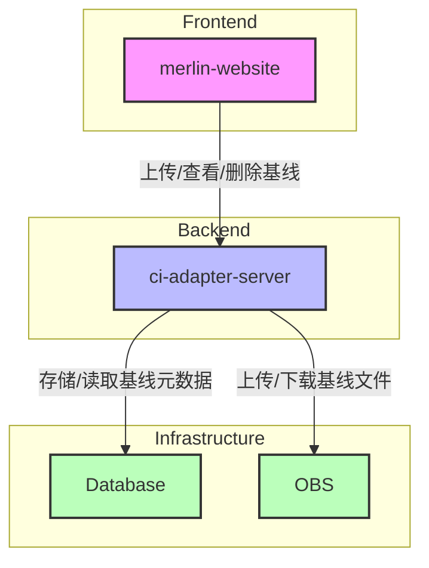


- 精度测试

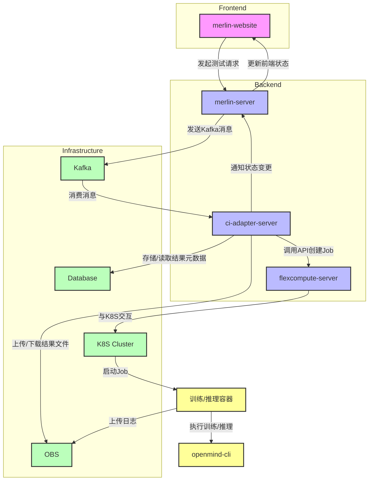


## 界面设计

>  以下高保真设计基于shadcn/ui，作为基础呈现和交互方式的表示，还需要重新基于魔乐社区的ui组件进行风格进行设计。

### 页面结构与UI设计

#### 基线管理Tab页


#### 模型测试面板


#### 模型测试状态面板


#### 精度测试历史表格视图

- 精度测试


#### 精度测试历史详情模态框


#### 精度测试发起模态框


### 界面元素交互设计

#### 基线管理Tab页

- 界面元素：“基线管理”面板
  - （默认“推理基线”）“推理基线” /“训练基线”切换按钮
  - 基线数据的Table View
  - 基线删除按钮
  - “新建推理基线”/“新建训练基线”按钮
- 交互：
  - 点击“推理基线” /“训练基线”切换按钮：
    - 切换不同的基线数据Table View
    - 根据类型，显示“新建推理基线”/“新建训练基线”按钮
  - 点击“新建推理基线”按钮：
    - 弹出“新建推理基线”模态框
  - 点击”新建训练基线“按钮：
    - 弹出”新建训练基线“模态框
  - 点击基线删除按钮：
    - 跳出Alert Dialog让用户确认


#### 模型测试面板

- Accordion组件：汇聚可用性测试/精度测试
- 交互：
  - 点击精度测试下拉：
    - 展开精度测试状态面板，以及测试历史的Data Table
  - 点击可用性测试下拉：
    - 展开可用性测试状态面板，以及测试历史的Data Table


#### 精度测试状态面板

- 状态：初始、排队中、测试中、测试终止、测试通过、测试失败

- 交互：

  - 初始状态：
    - 显示”发起测试“按钮
    - 点击按钮：打开精度测试配置模态框
  - 排队中/测试中状态：
    - 显示测试状态”测试中“/"排队中"和”终止测试“按钮，发起时间信息
    - 点击按钮：弹出确认对话框
  - 测试终止状态：
    - 显示测试状态”测试终止“和”再次测试“按钮、发起时间、终止时间信息，终止原因
    - 点击按钮：弹出精度测试配置模态框

  - 测试失败状态：
    - 显示测试状态”测试失败“和”再次测试“按钮，发起时间、失败时间信息，日志下载、镜像下载
    - 点击按钮：弹出精度测试配置模态框

  - 测试通过状态：
    - 显示测试状态”测试通过“和”再次测试“按钮，发起时间、通过时间信息，日志下载、镜像下载
    - 点击按钮：弹出精度测试配置模态框


#### 精度测试发起模态框

- 界面元素：
  - ”测试类型“（推理/训练）单选按钮
  - （默认disable）”作为基线运行“切换按钮
  - ”选择基线“下拉框
  - ”模型模板“下拉框
  - Python/Openmind/PyTorch/CANN等版本选择按钮
  - （默认隐藏）基线设置模态框
    - 推理基线设置模态框：
      - ”测试输入“文件选择控件
      - ”任务类型“下拉框
      - ”Metric“联动显示框
      - "阈值"联动显示框
    - 训练基线设置模态框
      - ”关联数据集“下拉框
  - （默认隐藏）基线信息模态框
    - 推理基线信息模态框
      - ”测试输入“联动显示框
      - ”任务类型“联动显示框
      - ”Metric“联动显示框
      - "阈值"联动显示框
    - 训练基线信息模态框
      - ”关联数据集“联动显示框
  - 确认/取消按钮
- 交互：
  - 点击”作为基线运行“切换按钮到enable：
    - 隐藏”选择基线“下拉框
    - ”测试类型“若为推理，弹出对应的”基线设置“模态框
      - 点击“测试输入”文件选择控件，弹出文件上传界面，限制`.txt`类型文件
      - “任务类型”限制为`text-generation`，Metric和阈值联动显示BLEU与>=0.75
    - “测试类型”若为训练，弹出对应的”基线设置“模态框
      - 点击“关联数据集”下拉框
        - 显示支持的数据集名称
  - 点击”选择基线“下拉框：
    - 呈现”基线管理“页已有的基线名称
  - 选择基线后：
    - 根据“测试类型”和基线类型，弹出对应的“基线信息”模态框
  - 点击”模型模板“下拉框：
    - 呈现支持的模型template列表
  - Python/Openmind/PyTorch/CANN级联版本选择，与可用性测试行为一致。
  - 点击确认：
    - 发起精度测试
  - 点击取消：
    - 关闭测试发起模态框


### 精度测试操作流程

1. 用户点击“发起测试”按钮
2. 打开相应的精度测试模态框
3. 用户可选“测试类型”：推理/训练
4. 用户选择python、openmind、pytorch、cann版本
5. 用户不点击“作为基线运行”开关，有“选择基线”下拉框，供用户选择已有基线
6. 用户点击“作为基线运行”开关，弹出“基线设置”模态框，根据训练/推理的场景可选内容不同。推理场景，用户需要上传“输入文本文件”，选择对应的“任务类型”、“Metric”、“阈值”信息；训练场景，用户需选择“关联数据集”
7. 用户点击确认/取消
8. 用户界面查看精度测试状态转移


### 基线管理操作流程

1. 用户选择推理或训练基线选项卡
2. 查看现有基线数据表格
3. 点击“上传新基线”按钮
4. 打开上传对话框
5. 用户填写基线信息并上传文件
6. 提交后，更新基线列表
7. 用户可点击查看基线详情

## 精度测试详细设计

### 基线管理与数据供给

​	模型详情页新增基线管理界面，用户能够进行基线的查看、新增、删除。后端`ci-adapter-server` 需要管理基线的生命周期，并将模型不同类型（推理/测试）的基线数据文件保存到对象存储（OBS）中。`flexcompute-server`拉起测试Job时需要进行对应对象路径环境变量挂载，供精度对比测试容器获取基线数据。


#### 基线表设计

模型基线元数据存储在后端`pg`数据库中，新增基线表`model_baselines`：

| 字段名           | 数据类型     | 描述                              |
| :--------------- | :----------- | :-------------------------------- |
| id               | SERIAL       | 基线唯一标识符，自动递增主键      |
| name             | VARCHAR(255) | 基线名称                          |
| type             | VARCHAR(50)  | 基线类型（inference 或 training） |
| owner            | VARCHAR(255) | 模型所有者                        |
| model_name       | VARCHAR(255) | 模型名称                          |
| input_file_name  | VARCHAR(255) | 输入文件名（仅推理）              |
| input_file_path  | VARCHAR(255) | 输入文件路径（仅推理）            |
| output_file_name | VARCHAR(255) | 输出文件名（仅推理）              |
| output_file_path | VARCHAR(255) | 输出文件路径（仅推理）            |
| metric           | VARCHAR(50)  | 评估指标（仅推理）                |
| operator         | VARCHAR(50)  | 操作值（仅推理）                  |
| threshold        | FLOAT        | 阈值（仅推理）                    |
| dataset          | VARCHAR(255) | 关联数据集（仅训练）              |
| loss_file_name   | VARCHAR(255) | Loss 文件名（仅训练）             |
| loss_file_path   | VARCHAR(255) | Loss 文件路径（仅训练）           |
| created_at       | TIMESTAMP    | 创建时间，默认当前时间            |
| updated_at       | TIMESTAMP    | 更新时间，默认当前时间，自动更新  |


#### API设计

##### 查询基线接口

>- 分页参数需要更多说明
>- 缺少按创建时间等字段排序

- Endpoint: GET /v1/model/{model-id}/baselines
- 参数:

  - type: 基线类型（可选，inference 或 training）
  - page_num: 页码（可选，默认值为 1）
  - page_size: 每页大小（可选，1~20，默认值为 10）
  - sort: 排序字段（可选，created_at | name，默认created_at）
  - order: 排序方向（可选，asc|desc，默认desc）
- 逻辑:

  1. 验证用户权限，确保用户有权限查看该模型的基线信息。

  2. 从 PostgreSQL 数据库中查询指定模型（由 owner 和 name 标识）的所有基线信息。

  3. 支持按基线类型过滤，并支持分页返回结果。
- 对于推理基线，返回基线名、创建时间、输入文本、输出文本文件名以及下载链接、Metric、阈值。
- 对于训练基线，返回基线名、创建时间、数据集、loss 文件名以及下载链接。
- 返回:

  - 成功: 返回 200 状态码和基线列表

  - 失败: 返回错误信息和相应的状态码

```json
// 成功响应示例
{
  "total": 2,
  "page_num": 1,
  "page_size": 10,
  "baselines": [
    {
      "id": "baseline_123",
      "name": "baseline_name_1",
      "type": "inference",
      "files": {
        "input": {
          "name": "input.txt",
          "size": 1024,
          "download_url": "https://your-obs-service.com/path/to/input.txt"
      	},
      	"output": {
          "name": "output.txt",
          "size": 1024,
          "download_url": "https://your-obs-service.com/path/to/output.txt"
      	},
      },
      "metric": "BLEU",
      "threshold": 0.75,
      "owner": "user_789",
      "model_name": "example_model",
      "created_at": "2023-10-31T12:00:00Z"
    },
    {
      "id": "baseline_124",
      "name": "baseline_name_2",
      "type": "training",
      "dataset": "AI_Connect/alpaca-gpt4-data",
      "files": {
        "loss_file": {
          "name": "loss.jsonl",
          "size": 1024,
          "download_url": "https://your-obs-service.com/path/to/loss.jsonl"
        },        
      },
      "owner": "user_789",
      "model_name": "example_model",
      "created_at": "2023-10-31T12:05:00Z"
    }
  ]
}
```

- 错误处理

1. 接收请求:

   - 错误: 请求格式不正确或缺少必要的头信息。
   - 响应: 返回 400 状态码和错误信息。
   - 示例:

   ```json
        {
          "error": "Bad Request",
          "message": "Invalid request format or missing headers."
        }
   ```

2. 权限校验：

   - 错误: 用户无权访问指定的模型或基线。
   - 响应: 返回 401 状态码和错误信息。
   - 示例:

   ```json
        {
          "error": "Bad Request",
          "message": "Unauthorized user identity"
        }
   ```

3. 数据库查询：

   - 错误: 数据库查询失败。
   - 响应: 返回 500 状态码和错误信息。
   - 示例：

   ```json
        {
          "error": "Internal Server Error",
          "message": "Failed to query baseline metadata from database."
        }
   ```

   

- 数据库查询SQL示意

```sql
SELECT id, name, type, owner, model_name, created_at,
       CASE WHEN type = 'inference' THEN input_file_name ELSE NULL END AS input_file_name,
       CASE WHEN type = 'inference' THEN CONCAT('https://your-obs-service.com/', input_file_path) ELSE NULL END AS input_file_download_url,
       CASE WHEN type = 'inference' THEN output_file_name ELSE NULL END AS output_file_name,
       CASE WHEN type = 'inference' THEN CONCAT('https://your-obs-service.com/', output_file_path) ELSE NULL END AS output_file_download_url,
       CASE WHEN type = 'inference' THEN metric ELSE NULL END AS metric,
       CASE WHEN type = 'inference' THEN threshold ELSE NULL END AS threshold,
       CASE WHEN type = 'training' THEN dataset ELSE NULL END AS dataset,
       CASE WHEN type = 'training' THEN loss_file_name ELSE NULL END AS loss_file_name,
       CASE WHEN type = 'training' THEN CONCAT('https://your-obs-service.com/', loss_file_path) ELSE NULL END AS loss_file_download_url
FROM baselines
WHERE owner = $1 AND model_name = $2
AND ($3::text IS NULL OR type = $3)
ORDER BY created_at DESC
LIMIT $4 OFFSET $5;
```

​	其中input_file_path, output_file_path, 和 loss_file_path 是存储在数据库中的文件路径，并使用 CONCAT 函数构建完整的下载 URL。

- 流程示意

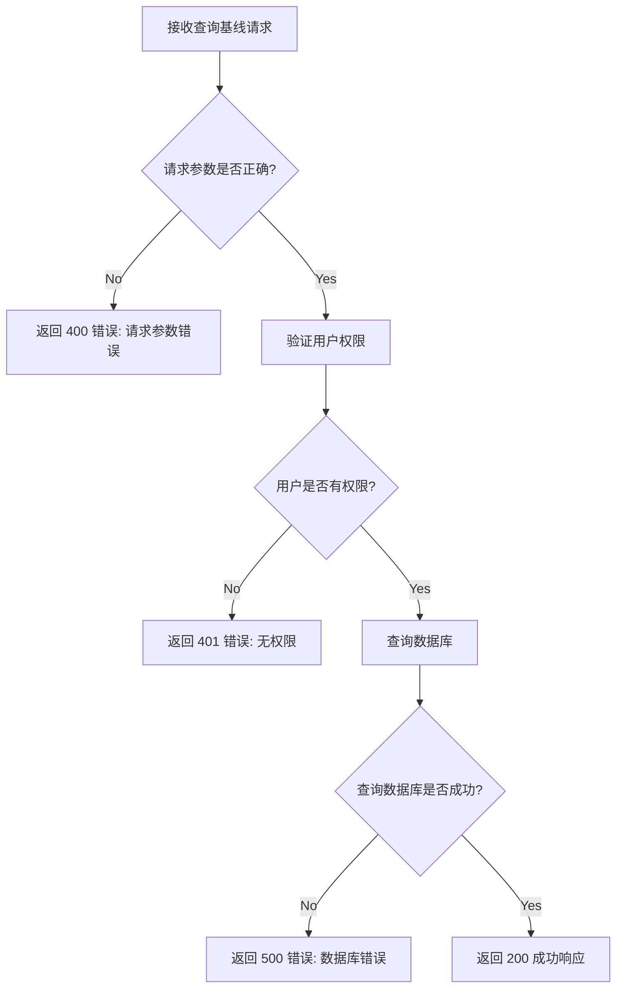


##### 创建基线

- Endpoint: POST /v1/model/{model-id}/baselines

- 参数：
  - name: 基线名称  ``[a-zA-Z0-9_-]{1,32}``
  - type: 基线类型（inference 或 training）
  
  - files:
  
    - input_file: 输入文件（仅推理）
  
    - output_file: 输出文件（仅推理）
  
    - loss_file: Loss 文件（仅训练）
  
  - metadata:
  
    - dataset_id: 关联数据集（仅训练）
    - metric: 指标 （仅推理）
  
    - threshold: 阈值 （仅推理）
  
    - operator: 操作符（如 >=）（仅推理）
  
- 逻辑：
  1. **验证用户权限**: 确保用户是模型的 `owner` 或有编辑权限。
  2. **文件格式/大小预校验**：内容预校验
  3. **文件上传**: 将文件上传到 OBS，并获取文件路径。
  4. **数据库记录**: 在 PostgreSQL 数据库中创建基线记录，包含文件路径和其他元数据。
  
- 返回：
  - **成功**: 返回 200 状态码和基线信息
  - **失败**: 返回错误信息和相应的状态码

```json
// 成功响应示例
{
  "id": "baseline_123",
  "name": "baseline_name",
  "type": "inference | training",
  "files": {
    "input": {
      "name": "input.txt",
      "size": 1024，
      "download_path": "obs://bucket/path/to/file",
    },
    "output": {
      // ...
    },
    "loss": {
      // ..
    }
  }, 
  "owner": "user_789",
  "model_name": "example_model",
  "created_at": "2023-10-31T12:00:00Z"
}
```

- 错误处理

1. 接收请求:

   - 错误: 请求格式不正确或缺少必要的头信息。
   - 响应: 返回 400 状态码和错误信息。
   - 示例:

   ```json
        {
          "error": "Bad Request",
          "message": "Invalid request format or missing headers."
        }
   ```

2. 解析请求：

   - 错误: 解析 `multipart/form-data` 失败。
   - 响应: 返回 400 状态码和错误信息。
   - 示例:

   ```json
        {
          "error": "Bad Request",
          "message": "Unsupported file format or failed to read file."
        }
   ```

3. 文件处理:

   - 错误: 文件读取失败或文件格式不支持。
   - 响应: 返回 400 状态码和错误信息。
   - 示例:

   ```json
        {
          "error": "Bad Request",
          "message": "Unsupported file format or failed to validate file."
        }
   ```

4. 上传到 OBS:

   - 错误: OBS 客户端初始化失败或上传失败。
   - 响应: 返回 500 状态码和错误信息。
   - 示例:

   ```json
        {
          "error": "Internal Server Error",
          "message": "Failed to upload file to object storage."
        }
   ```

5. 数据库交互:

   - 错误: 数据库连接失败或插入操作失败。
   - 响应: 返回 500 状态码和错误信息。
   - 示例:

   ```json
        {
          "error": "Internal Server Error",
          "message": "Failed to insert baseline metadata into database."
        }
   ```

6. 返回响应:

   - 错误: 构建响应失败。
   - 响应: 返回 500 状态码和错误信息。
   - 示例:

   ```json
        {
          "error": "Internal Server Error",
          "message": "Failed to construct response."
        }
   ```


- 数据库插入SQL示意：

```sql
INSERT INTO baselines (
    name, type, owner, model_name, input_file_name, input_file_path,
    output_file_name, output_file_path, metric, threshold, dataset,
    loss_file_name, loss_file_path, created_at, updated_at
) VALUES (
    $1, $2, $3, $4, $5, $6,
    $7, $8, $9, $10, $11,
    $12, $13, CURRENT_TIMESTAMP, CURRENT_TIMESTAMP
) RETURNING id;
```

- 参数说明:

  - $1 到 $13 是占位符，分别对应于基线的各个字段值。

  - RETURNING id 用于获取插入记录的自动生成的 id。

- 流程示意

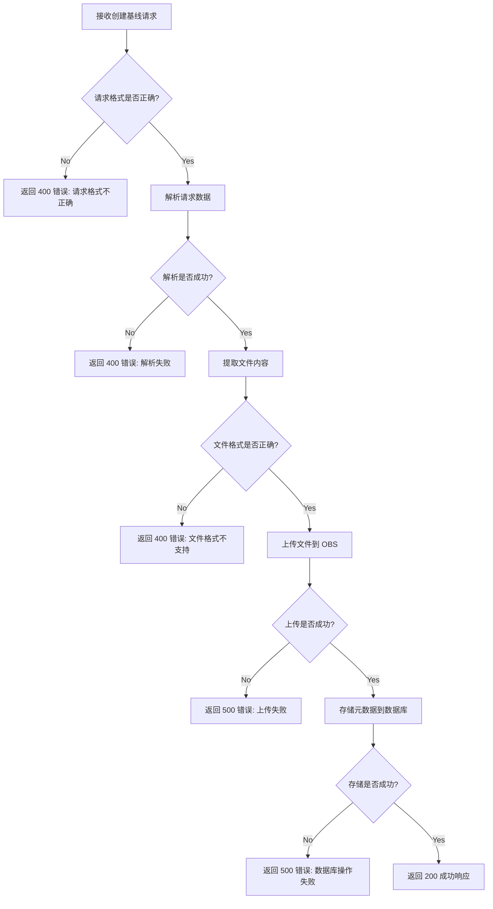


##### 删除基线

>- 没有软删除机制

- Endpoint: DELETE /v1/model/{model-id}/baselines/{baseline_id}

- 逻辑：
  1. **验证用户权限**: 确保用户有权限删除该基线。
  2. **删除 OBS 文件**: 删除 OBS 中的相关文件。
  3. **删除数据库记录**: 从 PostgreSQL 数据库中删除基线记录。
- 返回：
  -  **成功**: 返回 200状态码
  -  **失败**: 返回错误信息和相应的状态码

- 错误处理：

1. 接收请求:

   - 错误: 请求格式不正确或缺少必要的头信息。
   - 响应: 返回 400 状态码和错误信息。
   - 示例:

   ```json
        {
          "error": "Bad Request",
          "message": "Invalid request format or missing headers."
        }
   ```

2. 依赖检查：

   - 错误：基线正在被测试服务使用。
   - 响应：返回409（Conflict）错误码和错误信息。
   - 示例：

   ```json
        {
          "error": "Bad Request",
          "message": "Baseline in used by test"
        }
   ```

3. 权限校验：

   - 错误: 用户无权访问删除指定的模型基线。
   - 响应: 返回 401 状态码和错误信息。
   - 示例:

   ```json
        {
          "error": "Bad Request",
          "message": "Unauthorized user identity"
        }
   ```

4. OBS删除异常:

   - 错误: 删除 OBS 中的文件失败。
   - 响应: 返回 500 状态码和错误信息。
   - 示例：

   ```json
        {
          "error": "Internal Server Error",
          "message": "Failed to delete baseline data from object storage."
        }
   ```

   

5. 数据库删除：

   - 错误: 数据库删除失败。
   - 响应: 返回 500 状态码和错误信息。
   - 示例：

   ```json
        {
          "error": "Internal Server Error",
          "message": "Failed to delete baseline metadata from database."
        }
   ```


- 流程示意:

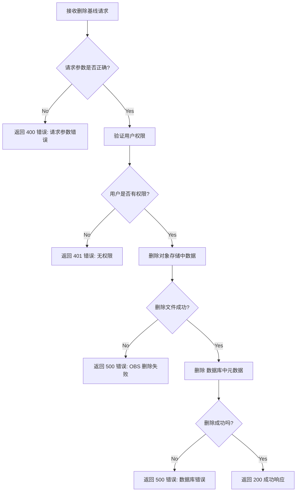


#### 基线数据文件存储

> 执行精度测试时根据模型ID隔离基线数据，并且在job拉起时通过环境变量获取该模型ID下特定测试类型的的基线文件，由`huaweicloud-sdk-go-obs`与`obsutils`组件实现和对象存储层的交互。

##### 前置条件

1. `ci-adapter-server`配置`API`请求鉴权，前端服务能够成功调用接口。
2. `ci-adapter-server`能访问外部`OBS`对象存储。


##### 流程概述

基线创建和文件存储过程概述如下：

1. 接受请求：`ci-adapter-server`接受来自`merlin-website`的API请求，包含基线的元数据和文件。
2. 解析请求：解析`multipart/form-data`，提取文件和其他表单数据。
3. 文件处理：
   - 将文件读取到内存中（或者写入临时文件）
   - 提取必要的信息（如文件名、内容摘要等）
4. 上传到`OBS`:
   - `ci-adapter-server`使用`huaweicloud-sdk-go-obs`将文件上传到OBS。
   - 获取文件在OBS中的路径。
5. 数据库交互：
   - 将基线的元数据和文件路径存储到后端`PostgreSQL`数据库中。
6. 返回响应：成功返回响应，包含基线的详细信息。


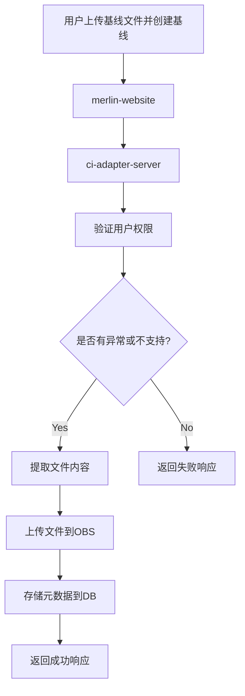


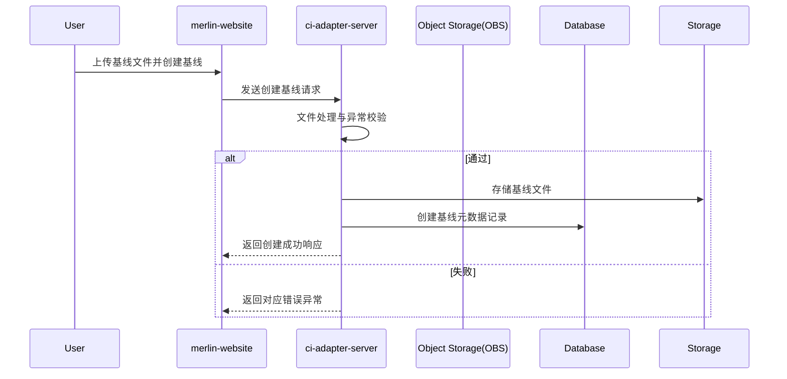


##### 基线文件目录结构

- 基线文件目录结构

对象存储侧为每个模型创建一个独立的目录，用户存储该模型的基线数据，例如：

```
    /{root_path}/baselines/
      ├── {model_id}/
      │   ├── inference/
      │   │   ├── {baseline_id}/
      │   │   │   ├── input.txt
      │   │   │   └── output.txt
      │   └── training/
      │       ├── {baseline_id}/
      │       │   └── loss.jsonl
```


#### 对比测试Job基线供给

`flexcompute-server`在模型测试的链路中提供NPU算力支撑，在启动精度对比测试的Job时，挂载对应的基线路径到环境变量，确保基线文件的可访问性。在Job中通过`obsutil`访问对象存储桶中的基线数据

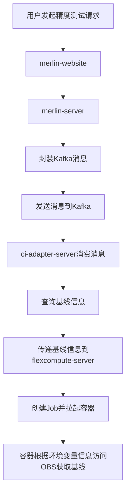

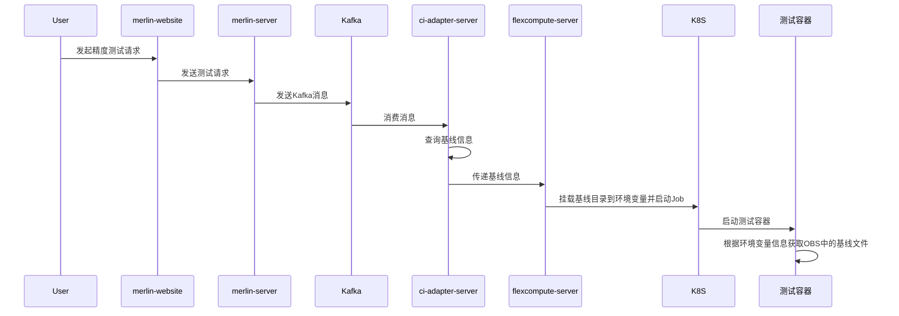


### 测试结果详情存储与回显

​	社区前端需要显示精度测试的详情（测试历史的表单中用户点击呈现），因此在Job容器执行测试任务之后，将训练输出产物、对比结果产物存储对象存储的特定路径下，测试流程结束后由`ci-adapter-server`管理对应对象存储路径下的产物并进行数据提取，为前端的结果详情显示提供数据源。


#### 测试结果详情表设计

| 字段名             | 数据类型     | 描述                                                      |
| :----------------- | :----------- | :-------------------------------------------------------- |
| id                 | SERIAL       | 测试结果唯一标识符，自动递增主键                          |
| baseline_id        | VARCHAR(255) | 关联的基线 ID，用于标识测试所基于的基线                   |
| test_id            | VARCHAR(255) | 关联的测试ID                                              |
| is_comparison_test | BOOLEAN      | 指示测试是否为对比测试                                    |
| test_type          | VARCHAR(50)  | 测试类型，区分训练还是推理                                |
| stage              | VARCHAR(50)  | 任务阶段，当前分为cpu数据下载/npu执行测试两阶段           |
| output             | VARCHAR(255) | 关联的输出文件名，存储推理或训练的结果                    |
| log                | VARCHAR(255) | 关联的日志文件名，记录测试执行过程的详细信息              |
| passed             | BOOLEAN      | 表示测试是否通过                                          |
| metric             | VARCHAR(50)  | 使用的评估指标（如 BLEU、绝对误差等），仅在对比测试时存在 |
| metric_value       | FLOAT        | 计算得到的指标值，仅在对比测试时存在                      |
| threshold          | FLOAT        | 通过测试的阈值，仅在对比测试时存在                        |
| operator           | VARCHAR(10)  | 用于比较的操作符（如 >=），仅在对比测试时存在             |
| created_at         | TIMESTAMP    | 创建时间，默认当前时间                                    |
| updated_at         | TIMESTAMP    | 更新时间，默认当前时间，自动更新                          |

- 说明：

  - 字段选择: 表中字段直接映射自下文`test_results.json` 中的字段。

  - 可选字段: 对于仅在对比测试时存在的字段（如 metric、metric_value、threshold、operator），可以在插入时根据 is_comparison_test 的值决定是否填充。

  - 时间戳: 使用 created_at 和 updated_at 字段来记录记录的创建和更新时间。


#### 测试结果详情格式

- `ci-adapter-server`需要为每个精度测试任务在对象存储的特定路径预创建一个{accuracy_test_id}目录，用于测试结果的存放：

  ```
  /{root_path}/results/
    ├── {accuracy_test_id}/
    │   ├── test_results.json
    │   ├── output.txt
    │   └── log.log
  ```

- 上述目录下的结果数据由测试Job容器执行完测试后生成，其中`test_results.json`的定义如下：

```json
{
  "baseline_id": "baseline_123",
  "is_comparison_test": true,
  "test_type": "inference",
  "stage": "test",
  "output": "output.txt",
  "log": "execution.log",
  "passed": true,
  "comparison_details": {
    "metric": "BLEU",
    "metric_value": 0.85,
    "threshold": 0.80,
    "operator": ">=",
  }
}
```

| 字段名             | 类型   | 描述                                                         | 示例值                    |
| ------------------ | ------ | ------------------------------------------------------------ | ------------------------- |
| baseline_id        | 字符串 | 关联的基线 ID，用于标识测试所基于的基线。                    | "baseline_123"            |
| is_comparison_test | 布尔值 | 指示测试是否为对比测试。                                     | true 或 false             |
| test_type          | 字符串 | 测试类型，区分训练还是推理。                                 | "inference" 或 "training" |
| stage              | 字符串 | 任务阶段，当前分为cpu数据下载/npu执行测试两阶段              | "download"或"test"        |
| output             | 字符串 | 关联的输出文件名，存储推理或训练的结果。                     | "output.txt"              |
| log                | 字符串 | 关联的日志文件名，记录测试执行过程的详细信息。               | "execution.log"           |
| passed             | 布尔值 | 表示测试是否通过                                             | true或false               |
| comparison_details | 对象   | 包含对比测试的详细信息，仅在 is_comparison_test 为 true 时存在。 | 见下表                    |

| 字段名       | 类型   | 描述                                    | 示例值 |
| ------------ | ------ | --------------------------------------- | ------ |
| metric       | 字符串 | 使用的评估指标（如 BLEU、绝对误差等）。 | "BLEU" |
| metric_value | 浮点数 | 计算得到的指标值。                      | 0.85   |
| threshold    | 浮点数 | 通过测试的阈值。                        | 0.80   |
| operator     | 字符串 | 用于比较的操作符（如 >=）。             | ">="   |


- `flexcompute-server`在创建测试job时，环境变量指定对象存储中的`results`目录路径(此值由`ci-adapter-server`传递，如`/model-ci/accuracy_test/results/{accuracy_test_id}/`)。
- 如果在`test_details.json`中没有`comparison_details`字段，前端不渲染带有具体数据的详情页，**前端的测试详情页应该只显示测试日志**。


#### 缓存设计

> 选型`Redis`作为缓存层，以优化获取测试详情信息场景下，对相关文件内容的读取。

1. 缓存策略

- **缓存键**: 确保唯一性，为 `test_details:{result_id}:{file_type}`，其中 `result_id` 是测试结果的唯一标识符，`file_type` 为:  `input`, `output`, `loss`。

  >更容易适应对象存储中文件路径的变化，但需要有额外的路径解析逻辑。

- **缓存值**: 存储文件内容的字符串。

- **缓存过期时间**: 30mins

- **缓存更新策略**： 

  - 对象存储中的对象若非数据异常，不会经常变动，因此仅在获取详情信息时，由`ci-adapter-server`从对象存储获取到对象后更新缓存。

- **缓存失效策略**： 

  - 使用 LRU（Least Recently Used）策略来自动清理不常用的缓存项，确保缓存空间的有效利用。

2. 安全性

- 确保只有授权的服务才能访问redis，用密码保护或者白名单。
- 无敏感信息不需要加密数据。

3. 性能优化

- **数据压缩**： 对大数据进行压缩减少内存和网络传输占用。
- **异步更新**： 更新缓存的操作可以异步发起，不阻塞响应流程。


#### API设计

##### 查询测试全部结果接口

- **Endpoint**: `GET /v1/model/{model-id}/test-results`

- **参数**：
  - `model-id`: 模型id (路径参数)
  -  `owner`: 模型所有者（路径参数）
  -  `name`: 模型名称（路径参数）
  -  `test-id`：测试任务id （Query参数）
  - `limit`: 限制返回的测试结果数量（可选，默认值为 3）
  - `type`：测试类型（accuracy | availability）
  - `workflow_type`：流程类型（inference | training）
  - `sort`：排序类型（created_at）
  - `order`：排序顺序（asc | desc，默认desc）

- **返回**：
- 成功: 返回 200 状态码和历史详情列表
  
- 失败: 返回错误信息和相应的状态码

```json
{
  "total": 3,
  "results": [
    {
      "id": 1,
      "baseline_id": "baseline_123",
      "is_comparison_test": true,
      "workflow_type": "inference",
      "type": "accuracy",
      "stage": "test",
      "output": "output.txt",
      "log": "execution.log",
      "passed": true,
      "metric": "BLEU",
      "metric_value": 0.85,
      "threshold": 0.80,
      "operator": ">=",
      "created_at": "2023-10-31T12:00:00Z"
    },
    // ... more results ...
  ]
}
```

- **错误处理**：

  1. 请求参数错误:

     - 错误: 缺少必要的路径参数或查询参数格式不正确。
     - 响应: 返回 400 状态码和错误信息。
     - 示例:

     ```json
          {
            "error": "Bad Request",
            "message": "Invalid request parameters."
          }
     ```

  2. 数据库错误:

     - 错误: 数据库查询失败。
     - 响应: 返回 500 状态码和错误信息。
     - 示例:

     ```json
          {
            "error": "Internal Server Error",
            "message": "Failed to retrieve test results from database."
          }
     ```

     

- 流程概述:

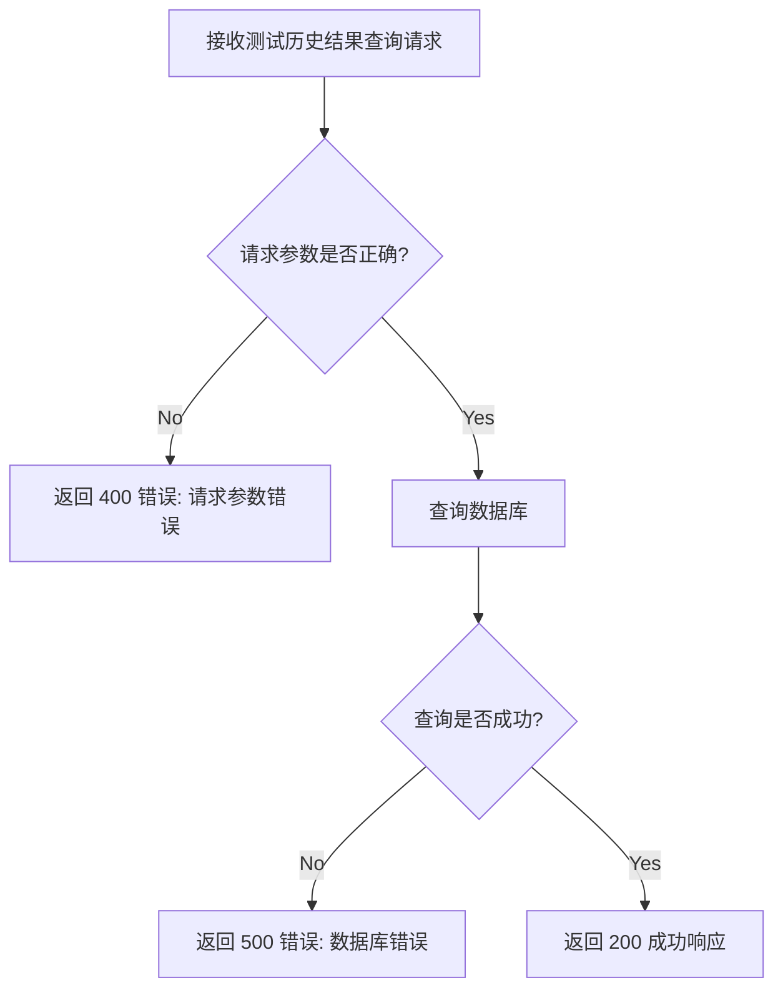


##### 查询测试详情接口

- **Endpoint**: GET /v1/model/{model-id}/test-results/{result_id}
- **参数**：
  - `model-id`: 模型id (路径参数)
  -  `owner`: 模型所有者
  -  `name`: 模型名称
  - `result_id`: 测试id（路径参数）
- **返回**：

  - 成功: 返回 200 状态码和测试详情

  - 失败: 返回错误信息和相应的状态码

```json
{
  "baseline_id": "baseline_123",
  "result_id": 1，
  "type": "accuracy"，
  "workflow_type": "inference",
  "input_content": "This is the input text content.", // 仅推理
  "output_content": "This is the output text content.", // 仅推理
  "loss_content": null, // or actual loss content for training // 仅训练
  "metric": "BLEU",
  "metric_value": 0.85,
  "threshold": 0.80,
  "operator": ">="
}
```

- **错误处理**：

  1. 请求参数错误:

     - 错误: 缺少必要的路径参数。

     - 响应: 返回 400 状态码和错误信息。

     - 示例:

     ```json
          {
            "error": "Bad Request",
            "message": "Invalid request parameters."
          }
     ```

  2. 测试结果不存在:

     - 错误: 请求的测试结果不存在。

     - 响应: 返回 404 状态码和错误信息。

     - 示例:

     ```json
          {
            "error": "Not Found",
            "message": "Test result not found."
          }
     ```

  3. 缓存或OBS错误:

     - 错误: 从缓存或 OBS 获取文件内容失败。

     - 响应: 返回 500 状态码和错误信息。

     - 示例:

     ```json
          {
            "error": "Internal Server Error",
            "message": "Failed to retrieve file content."
          }
     ```

     

- **流程概述**：

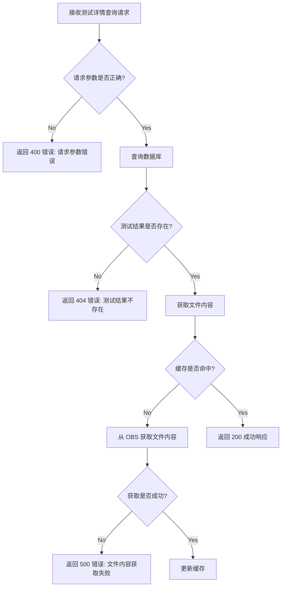


### 精度测试

#### 支持模型

与LLama-Factory支持的大语言模型列表一致：

| Model                                                       | Model size                       | Template         |
| ----------------------------------------------------------- | -------------------------------- | ---------------- |
| [Baichuan 2](https://huggingface.co/baichuan-inc)           | 7B/13B                           | baichuan2        |
| [BLOOM/BLOOMZ](https://huggingface.co/bigscience)           | 560M/1.1B/1.7B/3B/7.1B/176B      | -                |
| [ChatGLM3](https://huggingface.co/THUDM)                    | 6B                               | chatglm3         |
| [Command R](https://huggingface.co/CohereForAI)             | 35B/104B                         | cohere           |
| [DeepSeek (Code/MoE)](https://huggingface.co/deepseek-ai)   | 7B/16B/67B/236B                  | deepseek         |
| [Falcon](https://huggingface.co/tiiuae)                     | 7B/11B/40B/180B                  | falcon           |
| [Gemma/Gemma 2/CodeGemma](https://huggingface.co/google)    | 2B/7B/9B/27B                     | gemma            |
| [GLM-4](https://huggingface.co/THUDM)                       | 9B                               | glm4             |
| [InternLM2/InternLM2.5](https://huggingface.co/internlm)    | 7B/20B                           | intern2          |
| [Llama](https://github.com/facebookresearch/llama)          | 7B/13B/33B/65B                   | -                |
| [Llama 2](https://huggingface.co/meta-llama)                | 7B/13B/70B                       | llama2           |
| [Llama 3-3.2](https://huggingface.co/meta-llama)            | 1B/3B/8B/70B                     | llama3           |
| [LLaVA-1.5](https://huggingface.co/llava-hf)                | 7B/13B                           | llava            |
| [LLaVA-NeXT](https://huggingface.co/llava-hf)               | 7B/8B/13B/34B/72B/110B           | llava_next       |
| [LLaVA-NeXT-Video](https://huggingface.co/llava-hf)         | 7B/34B                           | llava_next_video |
| [MiniCPM](https://huggingface.co/openbmb)                   | 1B/2B/4B                         | cpm/cpm3         |
| [Mistral/Mixtral](https://huggingface.co/mistralai)         | 7B/8x7B/8x22B                    | mistral          |
| [OLMo](https://huggingface.co/allenai)                      | 1B/7B                            | -                |
| [PaliGemma](https://huggingface.co/google)                  | 3B                               | paligemma        |
| [Phi-1.5/Phi-2](https://huggingface.co/microsoft)           | 1.3B/2.7B                        | -                |
| [Phi-3](https://huggingface.co/microsoft)                   | 4B/7B/14B                        | phi              |
| [Qwen (1-2.5) (Code/Math/MoE)](https://huggingface.co/Qwen) | 0.5B/1.5B/3B/7B/14B/32B/72B/110B | qwen             |
| [Qwen2-VL](https://huggingface.co/Qwen)                     | 2B/7B/72B                        | qwen2_vl         |
| [StarCoder 2](https://huggingface.co/bigcode)               | 3B/7B/15B                        | -                |
| [XVERSE](https://huggingface.co/xverse)                     | 7B/13B/65B                       | xverse           |
| [Yi/Yi-1.5 (Code)](https://huggingface.co/01-ai)            | 1.5B/6B/9B/34B                   | yi               |
| [Yi-VL](https://huggingface.co/01-ai)                       | 6B/34B                           | yi_vl            |
| [Yuan 2](https://huggingface.co/IEITYuan)                   | 2B/51B/102B                      | yuan             |


#### 多卡支持

`openmind`工具链支持`deepspeed`配置


#### 前端测试状态转移

和模型可用性测试的状态转移保持一致：

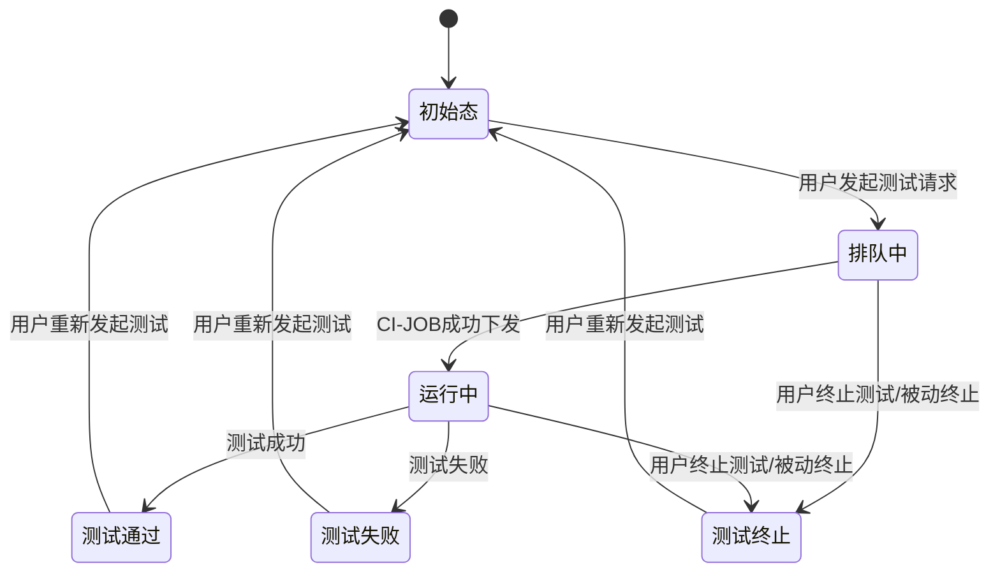


#### 训练

##### 训练执行流程

1. 容器启动

- 获取环境变量：

DATASET_INFO: 数据集信息

MODEL_OWNER: 模型所有者

MODEL_NAME: 模型名称

MODEL_TEMPLATE: 模型模板

BASELINE_LOSS_FILE（仅对比测试时存在）

- 安装 openmind-hub：

使用包管理工具（如 pip）安装 openmind-hub。


2. 下载模型和数据集

下载模型（由`flexcompute-server`多阶段下载）：

使用 openmind-hub 根据 MODEL_OWNER 和 MODEL_NAME 下载模型到本地路径。

下载数据集：

使用 openmind-hub 根据 DATASET_INFO 下载数据集到本地路径。


3. 执行训练

- 固定随机数：
  - 在训练脚本中设置固定的随机种子，以确保结果的可重复性。

- 执行 5000 steps 的训练：
  - 基于openmind工具链训练workflow，加载本地模型和数据集进行训练。


4. 结果处理

- 基线测试：

将生成的 loss 的 jsonl 文件存入OBS中的特定路径。

检查流程是否有错误，决定测试通过或失败。

- 对比测试：

读取环境变量中的 BASELINE_LOSS_FILE。

计算测试输出的 loss 和基线 loss 的相对误差。

如果误差 > 2%，则测试失败；否则测试通过。


5. 日志管理

- 日志输出：

将训练过程的日志输出到文件中。

- 保存日志文件到OBS的结果目录：

保存输出的日志文件到OBS的结果目录。


6. 结果归档

在PV结果目录下生成`test_results.json`。

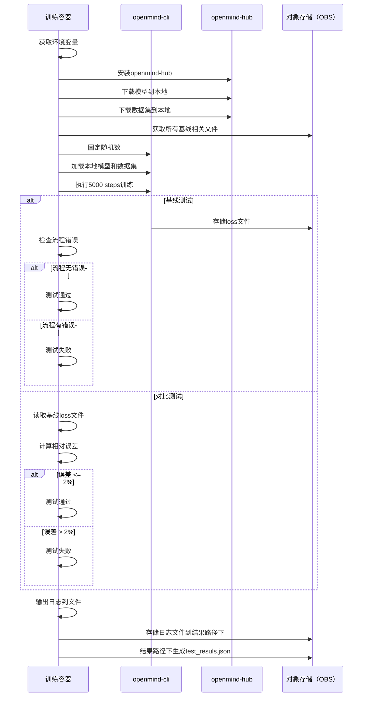


##### 作为基线运行

- 流程概述
  1. 用户请求：用户选择“作为基线运行”并发起训练请求。
  2. 基线目录预创建：ci-adapter-server 在 OBS的基线父目录下预创建一个新的基线目录，创建运行结果目录。
  3. 启动训练 Job：flexcompute-server 启动训练 Job，并将预创建的基线目录和结果目录挂载到容器中。
  4. 训练执行：Job 执行训练任务，生成 loss 的 jsonl 文件并写入结果。
  5. 完成处理：如果训练成功，保留基线目录，并将结果目录下的输出存储到基线目录下；如果失败，ci-adapter-server删除预创建的基线目录。

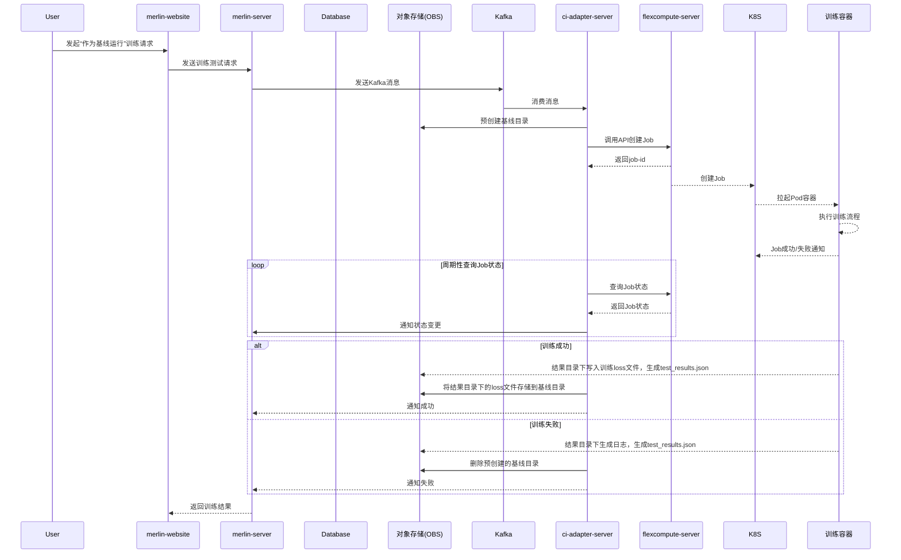


##### 对比测试

- 流程概述
  
  - 用户请求：用户选择对比测试并发起训练请求。
  
  - 消息封装发送：merlin-server 发送对应kafka消息。
  
  - 消息消费与启动训练job：ci-adapter-server消费消息、查询基线信息并通知flexcompute-server 启动训练 Job。
  
  - 训练执行：Job 执行训练任务，并将输出的 loss 文件与基线的 loss 文件进行对比。
  
  - 结果处理：根据阈值判断测试是否成功，将结果存储到OBS的结果目录下。
  
    
  

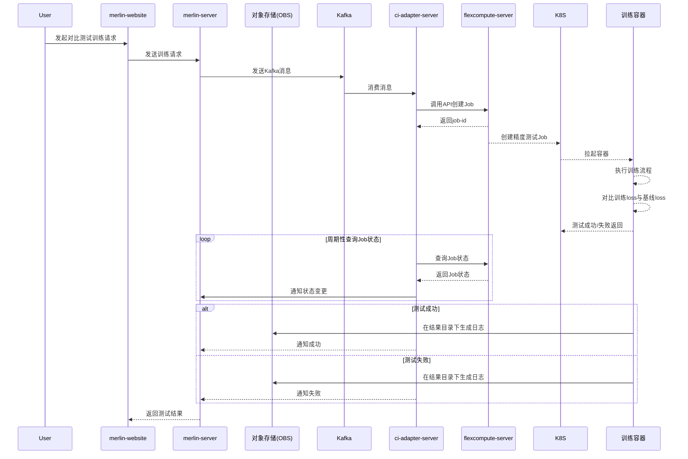


#### 推理


##### 推理执行流程

1. 容器启动

- 获取环境变量：

  - MODEL_OWNER: 模型所有者

  - MODEL_NAME: 模型名称

  - MODEL_TEMPLATE: 模型模板

  - INPUT_FILE_PATH: 输入文本文件路径

  - BASELINE_OUTPUT_FILE（仅对比测试时存在）

- 安装  openmind-hub：
  - 使用包管理工具（如 pip）安装 openmind-hub。


2. 下载模型

- 下载模型（`flexcompute-server`预下载）：

  - 使用 openmind-hub 根据 MODEL_OWNER 和 MODEL_NAME 下载模型到本地路径。

  

3. 执行推理

- 基线测试：

  - 读取环境变量中的 INPUT_FILE_PATH，将文件内容作为输入。

  - 使用 openmind-cli 执行单次前向推理。

  - 将输出文本存入OBS对应的的基线目录。

- 对比测试：

  - 读取环境变量中的 INPUT_FILE_PATH 和 BASELINE_OUTPUT_FILE。

  - 使用 openmind-cli 执行单次前向推理。

  - 计算推理输出文本与基线输出文本的 BLEU 值。

  - 根据 BLEU 值与阈值的比较，判断测试通过或失败。


4. 日志管理

- 日志输出：
  - 将推理过程的日志输出到文件中。

- 保存日志文件到OBS的结果目录
  - 保存输出的日志文件到OBS的结果目录。


5. 结果归档

在OBS结果目录下生成`test_results.json`。


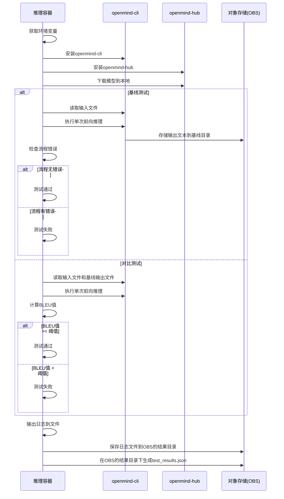


##### 作为基线运行

- 流程概述
    	1. merlin-server 发送kafka消息。
    	2. ci-adapter-server 消费 Kafka 消息，预创建基线目录，并调用 flexcompute-server 创建 Job，环境变量挂载基线目录和结果目录。
    	3. 推理 Job 执行模型推理，将 output 文件写入及结果目录，merlin-server将结果文件存储到基线目录下并将基线数据入库。
    	4. 如果推理失败，ci-adapter-server 删除预创建的基线目录。

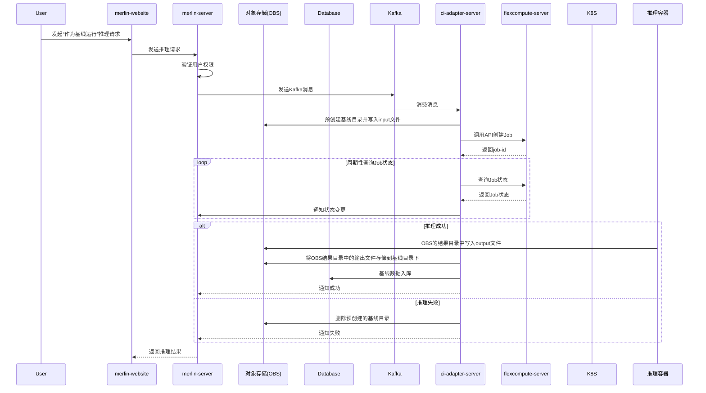


##### 对比测试

- 流程概述
  1. merlin-server 并通过 Kafka 发送消息。
  2. ci-adapter-server 查询基线信息，并调用 flexcompute-server 创建 Job，环境变量基线目录和结果目录。
  3. 推理 Job 执行模型推理，将输出的 output 文件与基线的 output 文件进行对比。
  4. 根据对比结果判断测试是否成功，将日志文件生成在OBS的结果目录下。

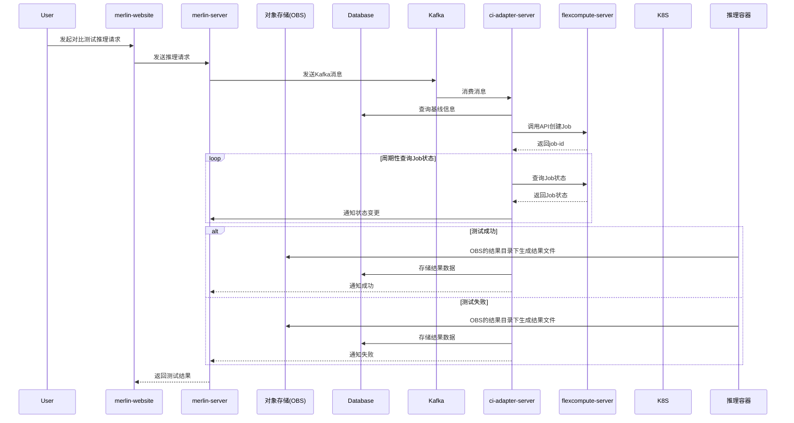


#### 服务间接口变更

##### 新增/修改Topic

`usability_test_created`

`usability_test_stopped`

`accuracy_test_created`

`accuracy_test_stopped`


##### accuracy_test_created消息新增字段

| 字段名               | 类型   | 描述                                                         | 示例值                              | 是否必选 |
| -------------------- | ------ | ------------------------------------------------------------ | ----------------------------------- | -------- |
| test_type            | string | 区分测试类型（如可用性测试、精度测试）                       | "accuracy_test" \| "usability_test" | 是       |
| model_test_type      | string | 区分基础测试类型（推理或训练）                               | "inference"  \|  "training"         | 是       |
| model_template       | string | 精度测试执行所需的模型模板                                   | 见约束对应章节                      | 否       |
| dataset_id           | string | 训练精度测试关联的数据集信息，用于下载数据集                 | "dataset_abc"                       | 否       |
| baseline_id          | string | 训练关联的基线id                                             | "baseline123"                       | 是       |
| input_file_path      | string | 推理精度测试输入文本文件的路径，用于推理测试                 | "/path/to/input.txt"                | 否       |
| baseline_output_file | string | 精度测试基线输出文本文件/loss文件的路径，用于对比测试        | "/path/to/baseline_output.txt"      | 否       |
| baseline_dir_path    | string | 已有/预创建的基线目录路径，用于subpath挂载                   | "/path/to/baseline_dir"             | 否       |
| result_dir_path      | string | 测试任务的结果目录路径，用于subpath挂载，用于容器存储测试结果物料 | "/path/to/result_dir"               | 是       |


##### accuracy_test_stopped消息新增字段

| 字段名          | 类型   | 描述                                   | 示例值                               | 是否必选 |
| --------------- | ------ | -------------------------------------- | ------------------------------------ | -------- |
| test_type       | string | 区分测试类型（如可用性测试、精度测试） | "accuracy_test"  \| "usability_test" | 是       |
| model_test_type | string | 区分基础测试类型（推理或训练）         | "inference" \| "training"            | 是       |


##### merlin-server新增基线生命周期管理接口

略


## 附录

### `API`错误码

400 Bad Request:

- INVALID_BASELINE_NAME: 基线名称不符合规则
- INVALID_FILE_FORMAT: 文件格式不正确
- FILE_TOO_LARGE: 文件超过大小限制(2MB)
- DUPLICATE_BASELINE_NAME: 基线名称重复

403 Forbidden:

- PERMISSION_DENIED: 无权限操作

404 Not Found:

- BASELINE_NOT_FOUND: 基线不存在

409 Conflict:

- BASELINE_IN_USE: 基线正在被测试任务使用

500 Internal Error:

- STORAGE_ERROR: 存储服务异常 
- INTERNAL_SERVER_ERROR: 内部服务异常

### `API Swagger`定义

```json
{
  "swagger": "2.0",
  "info": {
    "version": "1.0.0",
    "title": "Baseline Management API"
  },
  "host": "api.example.com",
  "basePath": "/v1",
  "schemes": ["https"],
  "paths": {
    "/model/{owner}/{name}/baselines": {
      "post": {
        "summary": "Create a new baseline",
        "parameters": [
          {
            "name": "owner",
            "in": "path",
            "required": true,
            "type": "string"
          },
          {
            "name": "name",
            "in": "path",
            "required": true,
            "type": "string"
          },
          {
            "name": "body",
            "in": "formData",
            "required": true,
            "schema": {
              "$ref": "#/definitions/BaselineCreateRequest"
            }
          }
        ],
        "responses": {
          "201": {
            "description": "Baseline created successfully",
            "schema": {
              "$ref": "#/definitions/BaselineResponse"
            }
          },
          "400": {
            "description": "Invalid input"
          },
          "401": {
            "description": "Unauthorized"
          }
        }
      },
      "get": {
        "summary": "Get all baselines for a model",
        "parameters": [
          {
            "name": "owner",
            "in": "path",
            "required": true,
            "type": "string"
          },
          {
            "name": "name",
            "in": "path",
            "required": true,
            "type": "string"
          },
          {
            "name": "type",
            "in": "query",
            "required": false,
            "type": "string"
          },
          {
            "name": "page",
            "in": "query",
            "required": false,
            "type": "integer",
            "default": 1
          },
          {
            "name": "size",
            "in": "query",
            "required": false,
            "type": "integer",
            "default": 10
          }
        ],
        "responses": {
          "200": {
            "description": "List of baselines",
            "schema": {
              "$ref": "#/definitions/BaselineListResponse"
            }
          },
          "401": {
            "description": "Unauthorized"
          }
        }
      }
    },
    "/model/{owner}/{name}/baselines/{baseline_id}": {
      "delete": {
        "summary": "Delete a baseline",
        "parameters": [
          {
            "name": "owner",
            "in": "path",
            "required": true,
            "type": "string"
          },
          {
            "name": "name",
            "in": "path",
            "required": true,
            "type": "string"
          },
          {
            "name": "baseline_id",
            "in": "path",
            "required": true,
            "type": "integer"
          }
        ],
        "responses": {
          "204": {
            "description": "Baseline deleted successfully"
          },
          "401": {
            "description": "Unauthorized"
          },
          "404": {
            "description": "Baseline not found"
          }
        }
      }
    }
  },
  "definitions": {
    "BaselineCreateRequest": {
      "type": "object",
      "properties": {
        "name": {
          "type": "string"
        },
        "type": {
          "type": "string",
          "enum": ["inference", "training"]
        },
        "input_file": {
          "type": "string",
          "format": "binary"
        },
        "output_file": {
          "type": "string",
          "format": "binary"
        },
        "loss_file": {
          "type": "string",
          "format": "binary"
        },
        "dataset_id": {
          "type": "string"
        },
        "threshold": {
          "type": "number"
        },
        "operator": {
          "type": "string"
        }
      }
    },
    "BaselineResponse": {
      "type": "object",
      "properties": {
        "id": {
          "type": "integer"
        },
        "name": {
          "type": "string"
        },
        "type": {
          "type": "string"
        },
        "obs_path": {
          "type": "string"
        },
        "owner": {
          "type": "string"
        },
        "model_name": {
          "type": "string"
        },
        "created_at": {
          "type": "string",
          "format": "date-time"
        }
      }
    },
    "BaselineListResponse": {
      "type": "object",
      "properties": {
        "total": {
          "type": "integer"
        },
        "page": {
          "type": "integer"
        },
        "size": {
          "type": "integer"
        },
        "baselines": {
          "type": "array",
          "items": {
            "$ref": "#/definitions/BaselineResponse"
          }
        }
      }
    }
  }
}
```


```yaml
swagger: "2.0"
info:
  version: "1.0.0"
  title: "Baseline Management API"
host: "api.example.com"
basePath: "/v1"
schemes:
  - "https"
paths:
  /model/{owner}/{name}/baselines:
    post:
      summary: "Create a new baseline"
      parameters:
        - name: "owner"
          in: "path"
          required: true
          type: "string"
        - name: "name"
          in: "path"
          required: true
          type: "string"
        - name: "body"
          in: "formData"
          required: true
          schema:
            $ref: "#/definitions/BaselineCreateRequest"
      responses:
        201:
          description: "Baseline created successfully"
          schema:
            $ref: "#/definitions/BaselineResponse"
        400:
          description: "Invalid input"
        401:
          description: "Unauthorized"
    get:
      summary: "Get all baselines for a model"
      parameters:
        - name: "owner"
          in: "path"
          required: true
          type: "string"
        - name: "name"
          in: "path"
          required: true
          type: "string"
        - name: "type"
          in: "query"
          required: false
          type: "string"
        - name: "page"
          in: "query"
          required: false
          type: "integer"
          default: 1
        - name: "size"
          in: "query"
          required: false
          type: "integer"
          default: 10
      responses:
        200:
          description: "List of baselines"
          schema:
            $ref: "#/definitions/BaselineListResponse"
        401:
          description: "Unauthorized"
  /model/{owner}/{name}/baselines/{baseline_id}:
    delete:
      summary: "Delete a baseline"
      parameters:
        - name: "owner"
          in: "path"
          required: true
          type: "string"
        - name: "name"
          in: "path"
          required: true
          type: "string"
        - name: "baseline_id"
          in: "path"
          required: true
          type: "integer"
      responses:
        204:
          description: "Baseline deleted successfully"
        401:
          description: "Unauthorized"
        404:
          description: "Baseline not found"
definitions:
  BaselineCreateRequest:
    type: "object"
    properties:
      name:
        type: "string"
      type:
        type: "string"
        enum: ["inference", "training"]
      input_file:
        type: "string"
        format: "binary"
      output_file:
        type: "string"
        format: "binary"
      loss_file:
        type: "string"
        format: "binary"
      dataset_id:
        type: "string"
      threshold:
        type: "number"
      operator:
        type: "string"
  BaselineResponse:
    type: "object"
    properties:
      id:
        type: "integer"
      name:
        type: "string"
      type:
        type: "string"
      obs_path:
        type: "string"
      owner:
        type: "string"
      model_name:
        type: "string"
      created_at:
        type: "string"
        format: "date-time"
  BaselineListResponse:
    type: "object"
    properties:
      total:
        type: "integer"
      page:
        type: "integer"
      size:
        type: "integer"
      baselines:
        type: "array"
        items:
          $ref: "#/definitions/BaselineResponse"
```


```json
{
  "swagger": "2.0",
  "info": {
    "version": "1.0.0",
    "title": "Model Test API"
  },
  "host": "api.example.com",
  "basePath": "/v1",
  "schemes": ["https"],
  "paths": {
    "/model/{owner}/{name}/test-results": {
      "get": {
        "summary": "Get test history results",
        "parameters": [
          {
            "name": "owner",
            "in": "path",
            "required": true,
            "type": "string"
          },
          {
            "name": "name",
            "in": "path",
            "required": true,
            "type": "string"
          },
          {
            "name": "limit",
            "in": "query",
            "required": false,
            "type": "integer",
            "default": 3
          }
        ],
        "responses": {
          "200": {
            "description": "List of test results",
            "schema": {
              "$ref": "#/definitions/TestResultsResponse"
            }
          },
          "400": {
            "description": "Invalid request parameters"
          },
          "500": {
            "description": "Internal server error"
          }
        }
      }
    },
    "/model/{owner}/{name}/test-results/{result_id}/details": {
      "get": {
        "summary": "Get test result details",
        "parameters": [
          {
            "name": "owner",
            "in": "path",
            "required": true,
            "type": "string"
          },
          {
            "name": "name",
            "in": "path",
            "required": true,
            "type": "string"
          },
          {
            "name": "result_id",
            "in": "path",
            "required": true,
            "type": "integer"
          }
        ],
        "responses": {
          "200": {
            "description": "Test result details",
            "schema": {
              "$ref": "#/definitions/TestResultDetailsResponse"
            }
          },
          "400": {
            "description": "Invalid request parameters"
          },
          "404": {
            "description": "Test result not found"
          },
          "500": {
            "description": "Internal server error"
          }
        }
      }
    }
  },
  "definitions": {
    "TestResultsResponse": {
      "type": "object",
      "properties": {
        "total": {
          "type": "integer"
        },
        "results": {
          "type": "array",
          "items": {
            "$ref": "#/definitions/TestResult"
          }
        }
      }
    },
    "TestResult": {
      "type": "object",
      "properties": {
        "id": {
          "type": "integer"
        },
        "baseline_id": {
          "type": "string"
        },
        "is_comparison_test": {
          "type": "boolean"
        },
        "test_type": {
          "type": "string"
        },
        "stage": {
          "type": "string"
        },
        "output": {
          "type": "string"
        },
        "log": {
          "type": "string"
        },
        "passed": {
          "type": "boolean"
        },
        "metric": {
          "type": "string"
        },
        "metric_value": {
          "type": "number"
        },
        "threshold": {
          "type": "number"
        },
        "operator": {
          "type": "string"
        },
        "created_at": {
          "type": "string",
          "format": "date-time"
        }
      }
    },
    "TestResultDetailsResponse": {
      "type": "object",
      "properties": {
        "baseline_id": {
          "type": "string"
        },
        "test_type": {
          "type": "string"
        },
        "input_content": {
          "type": "string"
        },
        "output_content": {
          "type": "string"
        },
        "loss_content": {
          "type": "string"
        },
        "metric": {
          "type": "string"
        },
        "metric_value": {
          "type": "number"
        },
        "threshold": {
          "type": "number"
        },
        "operator": {
          "type": "string"
        }
      }
    }
  }
}
```


```yaml
swagger: "2.0"
info:
  version: "1.0.0"
  title: "Model Test API"
host: "api.example.com"
basePath: "/v1"
schemes:
  - "https"
paths:
  /model/{owner}/{name}/test-results:
    get:
      summary: "Get test history results"
      parameters:
        - name: "owner"
          in: "path"
          required: true
          type: "string"
        - name: "name"
          in: "path"
          required: true
          type: "string"
        - name: "limit"
          in: "query"
          required: false
          type: "integer"
          default: 3
      responses:
        200:
          description: "List of test results"
          schema:
            $ref: "#/definitions/TestResultsResponse"
        400:
          description: "Invalid request parameters"
        500:
          description: "Internal server error"
  /model/{owner}/{name}/test-results/{result_id}/details:
    get:
      summary: "Get test result details"
      parameters:
        - name: "owner"
          in: "path"
          required: true
          type: "string"
        - name: "name"
          in: "path"
          required: true
          type: "string"
        - name: "result_id"
          in: "path"
          required: true
          type: "integer"
      responses:
        200:
          description: "Test result details"
          schema:
            $ref: "#/definitions/TestResultDetailsResponse"
        400:
          description: "Invalid request parameters"
        404:
          description: "Test result not found"
        500:
          description: "Internal server error"
definitions:
  TestResultsResponse:
    type: "object"
    properties:
      total:
        type: "integer"
      results:
        type: "array"
        items:
          $ref: "#/definitions/TestResult"
  TestResult:
    type: "object"
    properties:
      id:
        type: "integer"
      baseline_id:
        type: "string"
      is_comparison_test:
        type: "boolean"
      test_type:
        type: "string"
      stage:
        type: "string"
      output:
        type: "string"
      log:
        type: "string"
      passed:
        type: "boolean"
      metric:
        type: "string"
      metric_value:
        type: "number"
      threshold:
        type: "number"
      operator:
        type: "string"
      created_at:
        type: "string"
        format: "date-time"
  TestResultDetailsResponse:
    type: "object"
    properties:
      baseline_id:
        type: "string"
      test_type:
        type: "string"
      input_content:
        type: "string"
      output_content:
        type: "string"
      loss_content:
        type: "string"
      metric:
        type: "string"
      metric_value:
        type: "number"
      threshold:
        type: "number"
      operator:
        type: "string"
```

